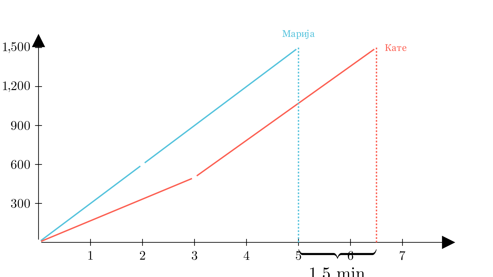

[⬅️ Назад кон Индексот](../../README.md) | [🧰 Skill: visual_reasoning](../../../tools/skill_guides/visual_reasoning.md)

# Трка (График растојание-време)

## 📝 Текст на задачата
Марија и Кате се тркаат на 1500 метри. На графикот растојание-време е дадена трката. Колку секунди после Марија, Кате стигнала до целта?

  

## 🧠 Анализа (Клучна идеја)
Најдете ја точката каде секоја од нив стигнува до 1500 метри (крајот на y-оската). Прочитајте го соодветното време на x-оската. Пресметајте ја разликата во минути и претворете ја во секунди.

## 💡 Решение

??? tip "Чекор 1: Читање од графикот"
    *   Марија (побрзата) стигнува до 1500 m во $t_1 = 5$ минути.
    *   Кате (побавната) стигнува до 1500 m во $t_2 = 6.5$ минути (на средина меѓу 6 и 7).

??? tip "Чекор 2: Пресметка на разликата"
    $$ \Delta t = 6.5 - 5 = 1.5 \text{ минути} $$

??? tip "Чекор 3: Претворање во секунди"
    $$ 1.5 \cdot 60 = 90 \text{ секунди} $$

## 🏁 Заклучок
Видете го решението погоре.

## 👩‍🏫 За наставници
Читањето на вредности меѓу линиите на мрежата (интерполација) е важна вештина. 6.5 е точно на средина.