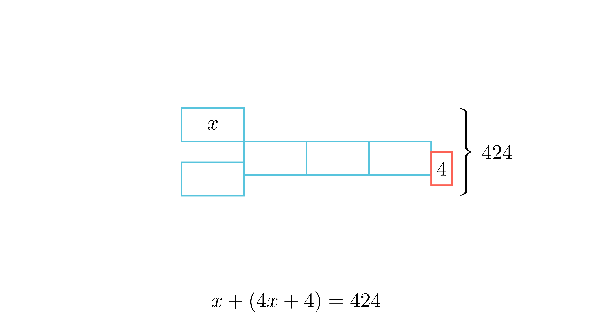

[⬅️ Назад кон Индексот](../../README.md) | [🧰 Skill: algebraic_manipulation](../../../skill_guides/algebraic_manipulation.md)

# Збир на два броја

## 📝 Текст на задачата
Збирот на два природни броја е 424. Ако првиот број се зголеми четири пати, а вториот се намали за 4, тогаш тие два новодобиени броеви ќе бидат еднакви меѓу себе. Кои се тие броеви?

  

## 🧠 Анализа (Клучна идеја)
Ова е класична задача која се решава со „метод на отсечки“ (Bar Model) или со равенка. Ако првиот број е $x$, тогаш зголемениот е $4x$. Бидејќи се изедначуваат, и вториот (намален) број е $4x$. Тоа значи дека вториот број пред намалувањето бил $4x+4$. Сега го знаеме нивниот збир.

## 💡 Решение

??? tip "Чекор 1: Означување"
    Нека првиот број е $x$.
    Кога ќе се зголеми 4 пати, тој станува $4x$.

??? tip "Чекор 2: Изразување на вториот број"
    Нека вториот број е $y$.
    Кога ќе се намали за 4, тој станува $y-4$.
    Условот вели дека новите броеви се еднакви: $4x = y - 4$.
    Од тука, вториот број можеме да го изразиме како $y = 4x + 4$.

??? tip "Чекор 3: Поставување на равенката за збирот"
    Збирот на двата броја е 424.
    $$ x + y = 424 $$
    Заменуваме $y = 4x + 4$:
    $$ x + (4x + 4) = 424 $$

??? tip "Чекор 4: Решавање"
    $$ 5x + 4 = 424 $$
    $$ 5x = 420 $$
    $$ x = 420 : 5 = 84 $$

??? tip "Чекор 5: Наоѓање на вториот број"
    $$ y = 424 - 84 = 340 $$
    (Или преку $y = 4(84) + 4 = 336 + 4 = 340$).
    
    **Одговор:** Броевите се 84 и 340.

## 🏁 Заклучок
Видете го решението погоре.

## 👩‍🏫 За наставници
Цртањето на модел помага: Првиот број е 1 дел. Вториот број е 4 дела плус 4. Вкупно имаме 5 дела плус 4 кои прават 424.