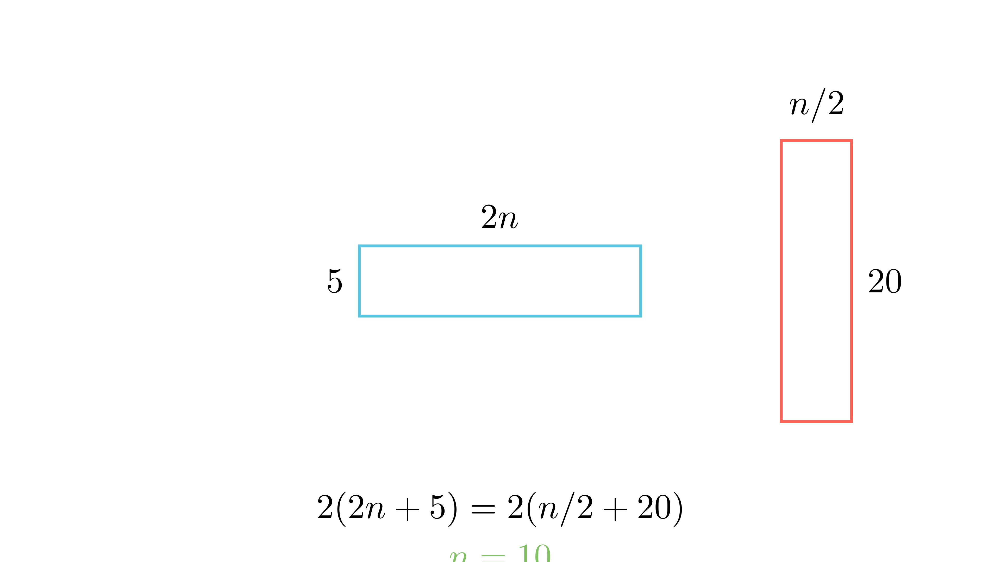

[⬅️ Назад кон Индексот](../../README.md) | [🧰 Skill: algebraic_manipulation](../../../tools/skill_guides/algebraic_manipulation.md)

# Трансформација на правоаголници

## 📝 Текст на задачата
Ана и Маја имале правоаголник $n \times 10$. Ана го пресекла на половина по должина и ги споила деловите за да добие долг правоаголник ($2n \times 5$). Маја го пресекла на половина по ширина и ги споила за да добие висок правоаголник ($n/2 \times 20$). За кое $n$ периметрите им се еднакви?

## 📐 Скица

  

## 🧠 Анализа
**Зошто е оваа задача тешка?**
Изразете ги периметрите преку $n$. Периметар на Ана: $2(2n + 5)$. Периметар на Маја: $2(n/2 + 20)$. Изедначете ги.

**Конструктивен потег:**
Изразете ги периметрите преку $n$. Периметар на Ана: $2(2n + 5)$. Периметар на Маја: $2(n/2 + 20)$. Изедначете ги.

## 💡 Решение

??? tip "Чекор 1: Периметар на Ана"
    Новиот правоаголник има страни $2n$ и $5$.
    $$ L_A = 2(2n + 5) = 4n + 10 $$

??? tip "Чекор 2: Периметар на Маја"
    Новиот правоаголник има страни $n/2$ и $20$.
    $$ L_M = 2(n/2 + 20) = n + 40 $$

??? tip "Чекор 3: Изедначување"
    $$ 4n + 10 = n + 40 $$
    $$ 3n = 30 $$
    $$ n = 10 $$
    
    Одговор: $n=10$.

## 🏁 Заклучок
Видете го решението погоре.

## 👩‍🏫 За наставници
Оваа задача покажува дека плоштината се зачувува при сечење (инваријанта), но периметарот се менува.