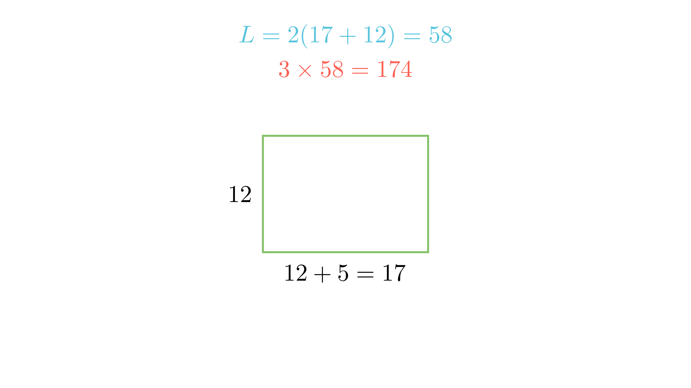

[⬅️ Назад кон Индексот](../../README.md) | [🧰 Skill: calculation](../../../tools/skill_guides/calculation.md)

# Трчање околу игралиште

## 📝 Текст на задачата
Спортското игралиште во форма на правоаголник има ширина од 12 метри и должина која е за 5 метри поголема од ширината. Група деца одлучиле да трчаат по патеката која го ограничува целото игралиште. Колку вкупно метри ќе истрчаат ако ја поминат таа патека три пати?

## 📐 Скица

  

## 🧠 Анализа
**Зошто е оваа задача тешка?**
Прво најдете ги димензиите на игралиштето. Ширина $b=12$, должина $a=12+5$. Потоа пресметајте го периметарот $L = 2(a+b)$. Вкупниот пат е $3 \cdot L$.

**Конструктивен потег:**
Прво најдете ги димензиите на игралиштето. Ширина $b=12$, должина $a=12+5$. Потоа пресметајте го периметарот $L = 2(a+b)$. Вкупниот пат е $3 \cdot L$.

## 💡 Решение

??? tip "Чекор 1: Димензии на игралиштето"
    Ширина $b = 12$ m.
    Должина $a = b + 5 = 12 + 5 = 17$ m.

??? tip "Чекор 2: Периметар (еден круг)"
    $$ L = 2 \cdot (a + b) = 2 \cdot (17 + 12) = 2 \cdot 29 = 58 \text{ m} $$

??? tip "Чекор 3: Вкупен пат"
    Децата трчаат 3 пати по патеката.
    $$ S = 3 \cdot L = 3 \cdot 58 = 174 \text{ m} $$

## 🏁 Заклучок
Видете го решението погоре.

## 👩‍🏫 За наставници
Внимавајте на терминот „за 5 метри поголема“. Тоа значи собирање ($+$), а не множење.