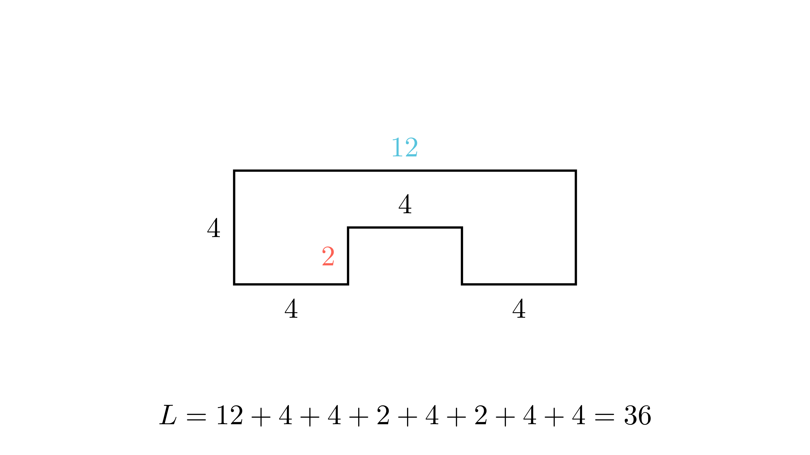

[⬅️ Назад кон Индексот](../../README.md) | [🧰 Skill: algebraic_manipulation](../../../tools/skill_guides/algebraic_manipulation.md)

# Периметар на сложена фигура

## 📝 Текст на задачата
Колку сантиметри изнесува периметарот на дадената фигура (види слика), ако важи: $HG = 12$ cm, $AH = AB = CD = EF = 2BC$?

## 📐 Скица

  

## 🧠 Анализа
**Зошто е оваа задача тешка?**
Фигурата е правоаголник со „вдлабнатина“ долу. Горната страна е $HG=12$. Долните хоризонтални страни се $AB, CD, EF$. Бидејќи фигурата е правоаголна, збирот на долните хоризонтални делови мора да е еднаков на горниот: $AB + CD + EF = HG = 12$. Искористете го условот за еднаквост за да ги најдете должините.

**Конструктивен потег:**
Фигурата е правоаголник со „вдлабнатина“ долу. Горната страна е $HG=12$. Долните хоризонтални страни се $AB, CD, EF$. Бидејќи фигурата е правоаголна, збирот на долните хоризонтални делови мора да е еднаков на горниот: $AB + CD + EF = HG = 12$. Искористете го условот за еднаквост за да ги најдете должините.

## 💡 Решение

??? tip "Чекор 1: Анализа на хоризонталните страни"
    Горната страна е $HG = 12$.
    Долните страни се $AB, CD, EF$. Нивниот збир е еднаков на $HG$ (проекција).
    $$ AB + CD + EF = 12 $$
    Дадено е $AB = CD = EF$. Нека нивната должина е $x$.
    $$ 3x = 12 \implies x = 4 \text{ cm} $$
    Значи $AB=4, CD=4, EF=4$.

??? tip "Чекор 2: Анализа на вертикалните страни"
    Дадено е $AH = AB = 4$. Значи $AH = 4$ и $FG = 4$ (поради симетрија/правоаголна форма).
    Дадено е $AB = 2BC$, значи $4 = 2BC \implies BC = 2$.
    Исто така $DE = BC = 2$ (вдлабнатината е симетрична).

??? tip "Чекор 3: Пресметка на периметарот"
    Ги собираме сите страни по ред:
    $HG = 12$
    $GF = 4$
    $FE = 4$
    $ED = 2$
    $DC = 4$
    $CB = 2$
    $BA = 4$
    $AH = 4$
    
    $$ L = 12 + 4 + 4 + 2 + 4 + 2 + 4 + 4 = 36 \text{ cm} $$

## 🏁 Заклучок
Видете го решението погоре.

## 👩‍🏫 За наставници
Клучно е да се разбере дека хоризонталните сегменти долу заедно ја прават должината на горниот сегмент. Ова е својство на правоаголни полигони.