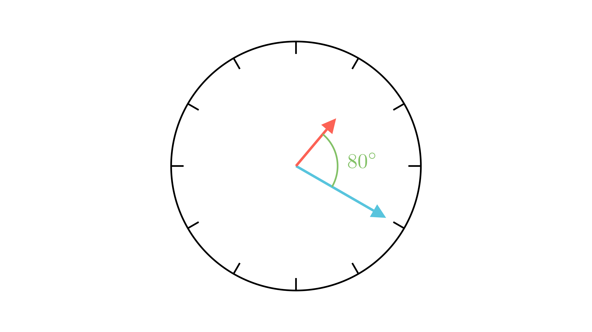

[⬅️ Назад кон Индексот](../../README.md) | [🧰 Skill: visual_reasoning](../../../tools/skill_guides/visual_reasoning.md)

# Агол на часовник

## 📝 Текст на задачата
Одреди го аголот што го формираат стрелките на часовникот во 13 часот и 20 минути.

## 📐 Скица

  

## 🧠 Анализа
**Зошто е оваа задача тешка?**
Часовникот е круг од $360^\circ$, поделен на 12 часа. Секој час зафаќа $360:12 = 30^\circ$. Минутната стрелка во 20 минути е точно на бројот 4. Часовната стрелка не е точно на 1, туку е поместена. Колку? Таа поминува $30^\circ$ за 60 минути, значи $0.5^\circ$ за секоја минута.

**Конструктивен потег:**
Часовникот е круг од $360^\circ$, поделен на 12 часа. Секој час зафаќа $360:12 = 30^\circ$. Минутната стрелка во 20 минути е точно на бројот 4. Часовната стрелка не е точно на 1, туку е поместена. Колку? Таа поминува $30^\circ$ за 60 минути, значи $0.5^\circ$ за секоја минута.

## 💡 Решение

??? tip "Чекор 1: Позиција на минутната стрелка"
    Во 20 минути, минутната стрелка покажува кон бројот 4.
    Аголот од 12 часот е: $4 \cdot 30^\circ = 120^\circ$.

??? tip "Чекор 2: Позиција на часовната стрелка"
    Во 13:20 (1:20), стрелката е помината од бројот 1.
    Таа се движи со брзина од $0.5^\circ$ во минута.
    Позицијата е: $1 \cdot 30^\circ + 20 \cdot 0.5^\circ = 30^\circ + 10^\circ = 40^\circ$.

??? tip "Чекор 3: Разлика (Агол меѓу нив)"
    $$ \alpha = |120^\circ - 40^\circ| = 80^\circ $$
    
    Одговор: Аголот е $80^\circ$.

## 🏁 Заклучок
Видете го решението погоре.

## 👩‍🏫 За наставници
Најчеста грешка е да се мисли дека малата стрелка стои фиксно на 1. Мора да се земе предвид нејзиното движење.