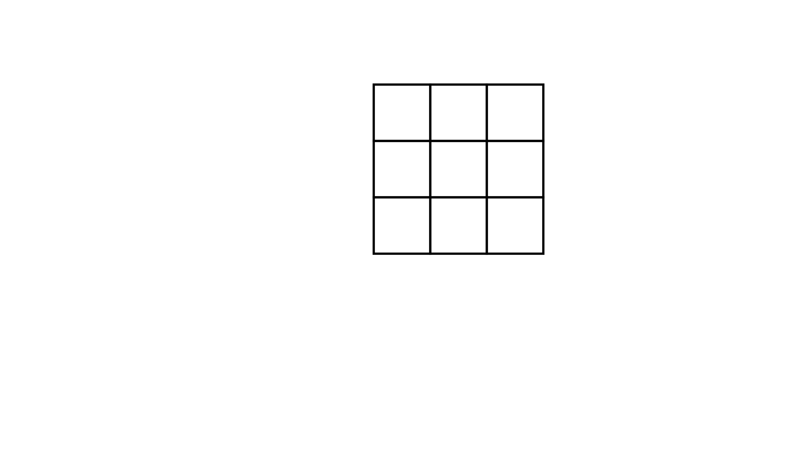

[⬅️ Назад кон Индексот](../../README.md) | [🧰 Skill: counting](../../../skill_guides/counting.md)

# Броење квадрати во мрежа

## 📝 Текст на задачата
Даден е цртеж со мрежа од квадрати. а) Колку квадратчиња имаат еднаква плоштина со најмалото? б) Колку квадрати имаат 4 пати поголема плоштина? в) Колку квадрати имаат 2 пати поголема плоштина? г) Колку вкупно квадрати има?

## 📐 Скица

  

## 🧠 Анализа
**Зошто е оваа задача тешка?**
Ова е задача за систематско броење. '4 пати поголема плоштина' значи квадрат составен од $2 \times 2$ мали квадратчиња. '2 пати поголема плоштина' е потешко - тоа се квадрати кои стојат 'косо' (дијагонално) внатре во $2 \times 2$ мрежа.

**Конструктивен потег:**
Ова е задача за систематско броење. '4 пати поголема плоштина' значи квадрат составен од $2 \times 2$ мали квадратчиња. '2 пати поголема плоштина' е потешко - тоа се квадрати кои стојат 'косо' (дијагонално) внатре во $2 \times 2$ мрежа.

## 💡 Решение

??? success "👀 Прикажи го решението"
    Според решението од натпреварот:
    
    **а) Најмали квадратчиња ($1 \times 1$):**
    Има вкупно **12** такви квадратчиња.
    
    **б) Квадрати со 4 пати поголема плоштина ($2 \times 2$):**
    Ова се квадрати составени од 4 мали. Со пребројување се наоѓаат **5** такви квадрати.
    
    **в) Квадрати со 2 пати поголема плоштина (Коси):**
    Ова се квадрати чии темиња се средините на страните на $2 \times 2$ квадратите. Има **5** такви квадрати.
    
    **г) Вкупно:**
    Вкупно = $12 + 5 + 5 = 22$ квадрати.
    *(Забелешка: Бројките се земени директно од клучот, бидејќи точната слика е специфична мрежа)*.

## 🏁 Заклучок
Видете го решението погоре.

## 👩‍🏫 За наставници
Најтешкиот дел за учениците се 'косите' квадрати. Покажете им дека плоштината на квадрат со дијагонала 2 (две страни на мал квадрат) е $d^2/2 = 2^2/2 = 2$, што е точно 2 пати повеќе од малиот ($1^2=1$).