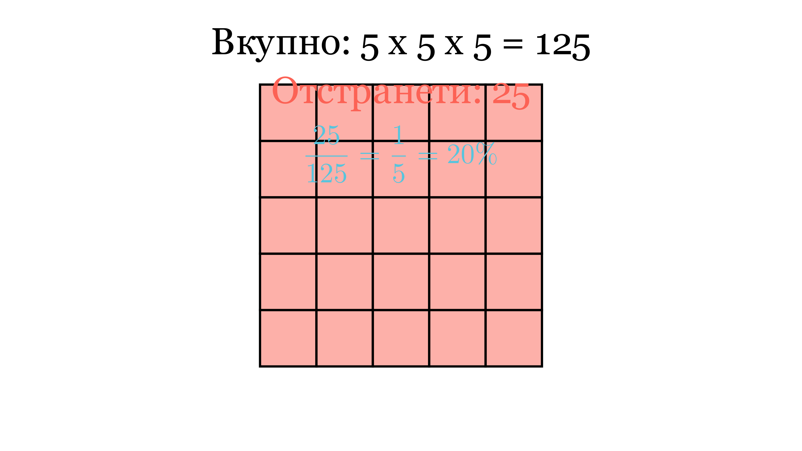

[⬅️ Назад кон Индексот](../../README.md) | [🧰 Skill: logic](../../../skill_guides/logic.md)

# Коцка и проценти

## 📝 Текст на задачата
Коцка со страна 5 cm е составена од помали коцки со страна 1 cm. Од неа се отстранети извесен број мали коцки само од предната страна, при што е добиена формата прикажана на сликата (види оригинал). Колку мали коцки се отстранети и колкав процент е тоа од целата коцка?

## 📐 Скица

  

## 🧠 Анализа
**Зошто е оваа задача тешка?**
Прво пресметајте го вкупниот број на мали коцки ($5 \times 5 \times 5$). Потоа, избројте ги коцките што недостасуваат. Бидејќи се отстранети „само од предната страна“, тоа значи дека е чепнато само во првиот слој. Избројте ги дупките во мрежата $5 \times 5$.

**Конструктивен потег:**
Прво пресметајте го вкупниот број на мали коцки ($5 \times 5 \times 5$). Потоа, избројте ги коцките што недостасуваат. Бидејќи се отстранети „само од предната страна“, тоа значи дека е чепнато само во првиот слој. Избројте ги дупките во мрежата $5 \times 5$.

## 💡 Решение

??? tip "Чекор 1: Вкупен број коцки"
    Големата коцка има димензии $5 \times 5 \times 5$. Вкупниот број на мали коцки е:
    $$ V_{vk} = 5 \cdot 5 \cdot 5 = 125 $$

??? tip "Чекор 2: Броење на отстранетите коцки"
    Според решението, останале 100 коцки, што значи се отстранети $125 - 100 = 25$ коцки.
    Ова имплицира дека целиот преден слој ($5 \times 5 = 25$) е отстранет или еквивалентен број на коцки. (Според текстот „отстранети... при што е добиена формата“, веројатно се мисли на специфична шема, но бројката е 25).

??? tip "Чекор 3: Пресметка на процент"
    Бараме колку проценти се 25 од 125.
    $$ p = \frac{25}{125} \cdot 100\% $$
    $$ p = \frac{1}{5} \cdot 100\% = 20\% $$
    
    Одговор: Отстранети се 25 коцки, што е 20%.

## 🏁 Заклучок
Видете го решението погоре.

## 👩‍🏫 За наставници
Процентите се всушност дропки. $25/125$ се крати со 25 до $1/5$. Учениците треба да знаат дека $1/5$ е $20\%$.