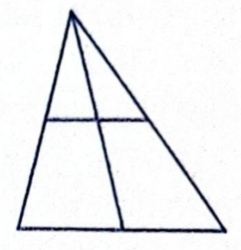

# Броење триаголници

## Текст на задачата
Колку различни триаголници има на цртежот?  
**Триаголниците може да се преклопуваат.**

---

## Анализа

Ова е задача за **визуелно броење**, каде не е доволно да се бројат
само најмалите триаголници.

Потребно е:
- систематско броење,
- разгледување на триаголници со различна големина,
- внимание на преклопување.

👉 Најдобар пристап: **броење по големина**.

---

## Решение

Ќе броиме чекор по чекор.

### Чекор 1: Најмали триаголници

На сликата се забележуваат:
1. еден мал триаголник горе лево  
2. еден мал триаголник горе десно  
3. еден мал триаголник долу десно  

➡️ Вкупно: **3 најмали триаголници**

---

### Чекор 2: Средни триаголници

Се добиваат со спојување на помали делови:
1. триаголник од левата половина  
2. триаголник од десната половина  

➡️ Вкупно: **2 средни триаголници**

---

### Чекор 3: Најголем триаголник

Целата фигура претставува еден триаголник.

➡️ **1 голем триаголник**

---

### Чекор 4: Вкупен број

\[
3 + 2 + 1 = 6
\]

---

## Заклучок

Вкупниот број на различни триаголници е
\[
\boxed{6}.
\]

---

## Олимписка верзија (кратко)

Се бројат:
- 3 мали,
- 2 средни,
- 1 голем триаголник.

➡️ **Вкупно 6.**

---

## За тутори (опционално)

- Клучна вештина: систематско броење
- Типична грешка: прескокнување на средни триаголници
- Прашање за ученици:  
  *„Дали овој триаголник е составен од други?“*
