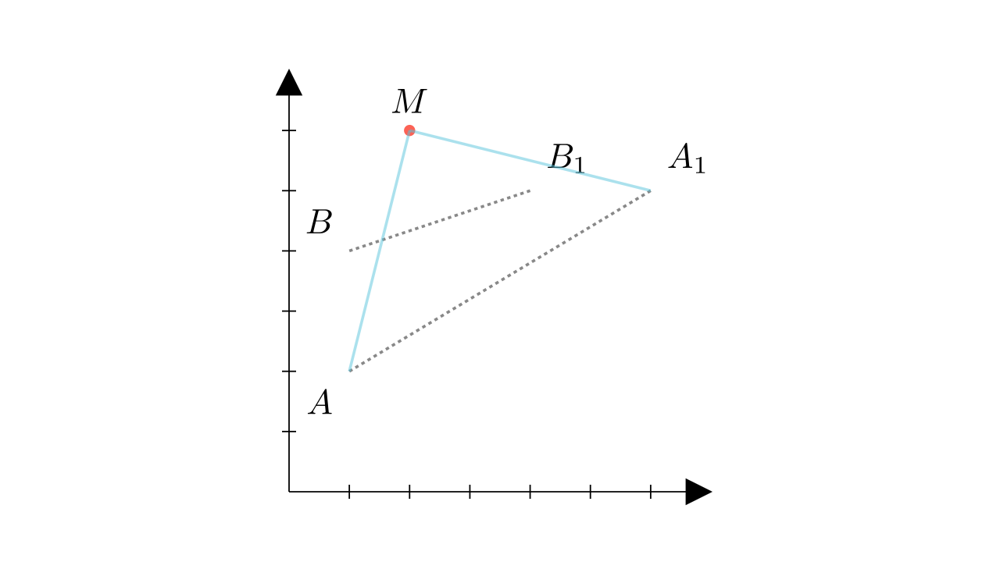

[⬅️ Назад кон Индексот](../../README.md) | [🧰 Skill: transformation_geometry](../../../tools/skill_guides/transformation_geometry.md)

# Ротација и координати

## 📝 Текст на задачата
При ротација со центар во точката $M$ и агол $\alpha$, точката $A(1,2)$ се пресликува во $A_1(6,5)$, а точката $B(1,4)$ во $B_1(4,5)$. Пресметај го збирот на координатите на точката $M$.

## 📐 Скица

> **👨‍💻 Geo-Mentor Code:**
> Одете во `assets/manim_code_log.md`, копирајте го кодот за `Task_2022_mun_y4_19a` и генерирајте ја сликата.

> **👨‍💻 Geo-Mentor Code:**
> Одете во `assets/manim_code_log.md`, копирајте го кодот за `Task_2022_mun_y4_19a` и генерирајте ја сликата.

## 🧠 Анализа
**Зошто е оваа задача тешка?**
Центарот на ротација $M$ е еднакво оддалечен од $A$ и $A_1$ ($MA=MA_1$), и од $B$ и $B_1$ ($MB=MB_1$). Значи $M$ лежи на симетралата на $AA_1$ и на симетралата на $BB_1$. Најди го пресекот на овие две прави.

**Конструктивен потег:**
Центарот на ротација $M$ е еднакво оддалечен од $A$ и $A_1$ ($MA=MA_1$), и од $B$ и $B_1$ ($MB=MB_1$). Значи $M$ лежи на симетралата на $AA_1$ и на симетралата на $BB_1$. Најди го пресекот на овие две прави.

## 💡 Решение

👀 Прикажи го решението

**Чекор 1: Симетрала на $AA_1$**
$A(1,2), A_1(6,5)$.
Средина $S_A = (\frac{1+6}{2}, \frac{2+5}{2}) = (3.5, 3.5)$.
Наклон $k_A = \frac{5-2}{6-1} = \frac{3}{5}$.
Наклон на симетралата $k'_A = -\frac{5}{3}$.
Равенка: $y - 3.5 = -\frac{5}{3}(x - 3.5)$.

**Чекор 2: Симетрала на $BB_1$**
$B(1,4), B_1(4,5)$.
Средина $S_B = (\frac{1+4}{2}, \frac{4+5}{2}) = (2.5, 4.5)$.
Наклон $k_B = \frac{5-4}{4-1} = \frac{1}{3}$.
Наклон на симетралата $k'_B = -3$.
Равенка: $y - 4.5 = -3(x - 2.5)$.

**Чекор 3: Пресек (Точка $M$)**
Изедначуваме $y$:
$$ -\frac{5}{3}(x - 3.5) + 3.5 = -3(x - 2.5) + 4.5 $$
Множиме со 3:
$$ -5(x - 3.5) + 10.5 = -9(x - 2.5) + 13.5 $$
$$ -5x + 17.5 + 10.5 = -9x + 22.5 + 13.5 $$
$$ -5x + 28 = -9x + 36 $$
$$ 4x = 8 \implies x = 2 $$

Наоѓаме $y$:
$$ y = -3(2 - 2.5) + 4.5 = -3(-0.5) + 4.5 = 1.5 + 4.5 = 6 $$

Точката е $M(2, 6)$.
Збирот на координатите е $2 + 6 = 8$.

**Одговор:** 8.

## 🏁 Заклучок
<Краен резултат.>

## 👩‍🏫 За наставници
Центарот на ротација е секогаш пресек на симетралите на отсечките што ги поврзуваат оригиналните и слика-точките.