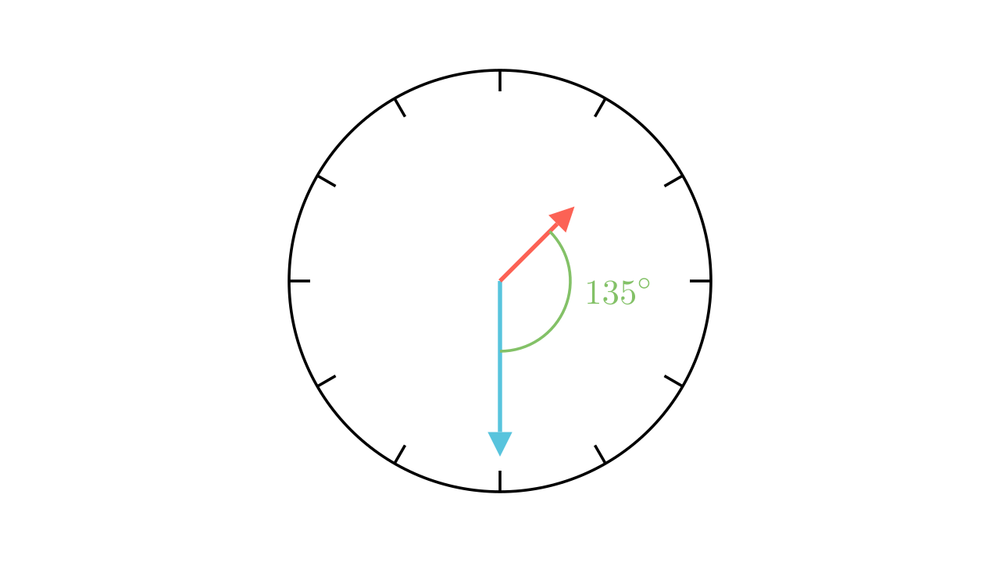

[⬅️ Назад кон Индексот](../../README.md) | [🧰 Skill: visual_reasoning](../../../tools/skill_guides/visual_reasoning.md)

# Агол на часовник (13:30)

## 📝 Текст на задачата
Одреди го помалиот агол кој го зафаќаат стрелките на часовникот во 13 часот и 30 минути.

## 📐 Скица

> **👨‍💻 Geo-Mentor Code:**
> Одете во `assets/manim_code_log.md`, копирајте го кодот за `Task_2023_mun_g6_2` и генерирајте ја сликата.

> **👨‍💻 Geo-Mentor Code:**
> Одете во `assets/manim_code_log.md`, копирајте го кодот за `Task_2023_mun_g6_2` и генерирајте ја сликата.

## 🧠 Анализа
**Зошто е оваа задача тешка?**
Во 13:30 (1:30), минутната стрелка е точно на 6. Часовната стрелка е точно на средина помеѓу 1 и 2. Аголот меѓу секој час е $30^\circ$. Пресметајте го аголот од 12 часот за двете стрелки и најдете ја разликата.

**Конструктивен потег:**
Во 13:30 (1:30), минутната стрелка е точно на 6. Часовната стрелка е точно на средина помеѓу 1 и 2. Аголот меѓу секој час е $30^\circ$. Пресметајте го аголот од 12 часот за двете стрелки и најдете ја разликата.

## 💡 Решение

👀 Прикажи го решението

**Чекор 1: Минутна стрелка**
Во 30 минути, стрелката е на бројот 6.
Агол од 12 часот: $6 \cdot 30^\circ = 180^\circ$.

**Чекор 2: Часовна стрелка**
Во 1:30, стрелката поминала 1 час и 30 минути.
Позиција: $1 \cdot 30^\circ + 30 \cdot 0.5^\circ = 30^\circ + 15^\circ = 45^\circ$.
(Таа е точно на средина меѓу 1 и 2).

**Чекор 3: Разлика**
$$ \alpha = |180^\circ - 45^\circ| = 135^\circ $$

Одговор: Аголот е $135^\circ$.

## 🏁 Заклучок
<Краен резултат.>

## 👩‍🏫 За наставници
Потсетете ги учениците дека $0.5^\circ$ е брзината на малата стрелка во минута ($30^\circ$ за 60 мин).