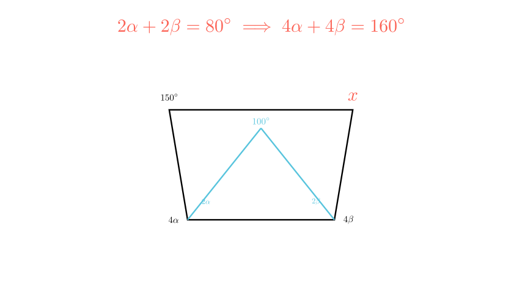

[⬅️ Назад кон Индексот](../../README.md) | [🧰 Skill: logic](../../../tools/skill_guides/logic.md)

# Агли во четириаголник

## 📝 Текст на задачата
Даден е четириаголник како на цртежот. Внатрешниот триаголник има агли $2\alpha, 2\beta$ и $100^\circ$. Големиот четириаголник има агли $4\alpha, 4\beta, 150^\circ$ и $x$. Одреди го аголот $x$.

## 📐 Скица

> **👨‍💻 Geo-Mentor Code:**
> Одете во `assets/manim_code_log.md`, копирајте го кодот за `Task_2025_mun_g6_4` и генерирајте ја сликата.

> **👨‍💻 Geo-Mentor Code:**
> Одете во `assets/manim_code_log.md`, копирајте го кодот за `Task_2025_mun_g6_4` и генерирајте ја сликата.

## 🧠 Анализа
**Зошто е оваа задача тешка?**
Задачата се решава во два чекора. Прво, искористете го малиот триаголник за да најдете колку е збирот $\alpha + \beta$. Потоа, искористете го тој збир за да ги најдете аглите на четириаголникот ($4\alpha + 4\beta = 4(\alpha+\beta)$). Збирот на агли во четириаголник е $360^\circ$.

**Конструктивен потег:**
Задачата се решава во два чекора. Прво, искористете го малиот триаголник за да најдете колку е збирот $\alpha + \beta$. Потоа, искористете го тој збир за да ги најдете аглите на четириаголникот ($4\alpha + 4\beta = 4(\alpha+\beta)$). Збирот на агли во четириаголник е $360^\circ$.

## 💡 Решение

👀 Прикажи го решението

**Чекор 1: Малиот триаголник**
Збирот на аглите во триаголник е $180^\circ$.
$$ 2\alpha + 2\beta + 100^\circ = 180^\circ $$
$$ 2\alpha + 2\beta = 80^\circ $$
Делиме со 2:
$$ \alpha + \beta = 40^\circ $$

**Чекор 2: Големиот четириаголник**
Збирот на аглите во четириаголник е $360^\circ$.
Аглите се: $4\alpha, 4\beta, 150^\circ, x$.
$$ 4\alpha + 4\beta + 150^\circ + x = 360^\circ $$
$$ 4(\alpha + \beta) + 150^\circ + x = 360^\circ $$

Заменуваме $\alpha + \beta = 40^\circ$:
$$ 4(40^\circ) + 150^\circ + x = 360^\circ $$
$$ 160^\circ + 150^\circ + x = 360^\circ $$
$$ 310^\circ + x = 360^\circ $$
$$ x = 50^\circ $$

## 🏁 Заклучок
<Краен резултат.>

## 👩‍🏫 За наставници
Не мора да ги наоѓаме $\alpha$ и $\beta$ поединечно (има бесконечно многу решенија за нив). Ни треба само нивниот збир. Ова е чест принцип во геометриските задачи.