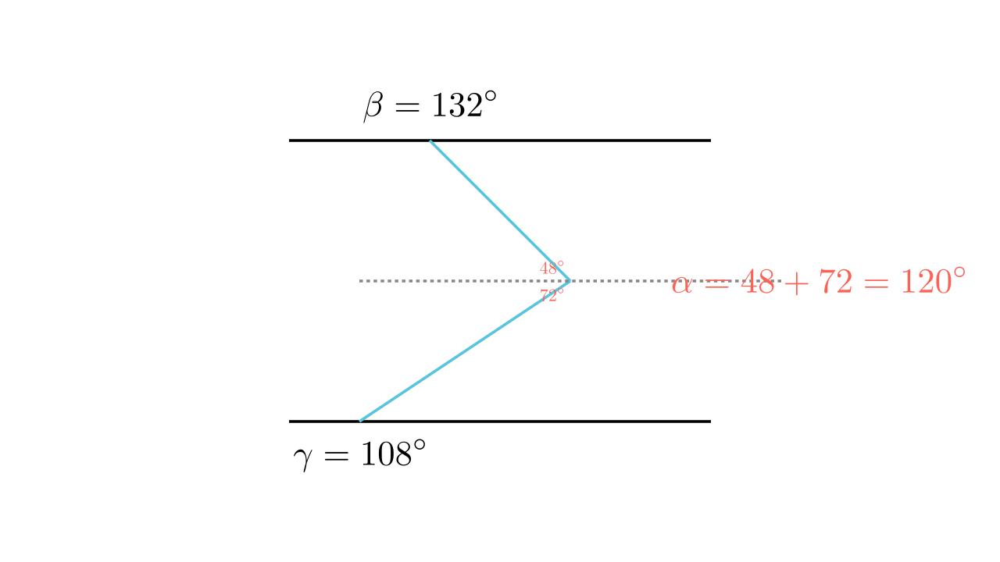

[⬅️ Назад кон Индексот](../../README.md) | [🧰 Skill: angle_chasing](../../../tools/skill_guides/angle_chasing.md)

# Агли меѓу паралелни прави

## 📝 Текст на задачата
Одреди го аголот $\alpha$ од цртежот, ако $a || b$, $\beta = 132^\circ$ и $\gamma = 108^\circ$. (Цртежот прикажува „скршена“ трансверзала меѓу две паралелни прави).

## 📐 Скица

> **👨‍💻 Geo-Mentor Code:**
> Одете во `assets/manim_code_log.md`, копирајте го кодот за `Task_2022_mun_g7_14` и генерирајте ја сликата.

> **👨‍💻 Geo-Mentor Code:**
> Одете во `assets/manim_code_log.md`, копирајте го кодот за `Task_2022_mun_g7_14` и генерирајте ја сликата.

## 🧠 Анализа
**Зошто е оваа задача тешка?**
Ова е познатото „M-правило“ или „правило на цик-цак“. Повлечете помошна права низ темето на аголот $\alpha$, паралелна со $a$ и $b$. Таа ќе го подели $\alpha$ на два дела. Едниот дел е еднаков на остриот агол долу (суплементен на $\gamma$), а другиот на остриот агол горе (суплементен на $\beta$).

**Конструктивен потег:**
Ова е познатото „M-правило“ или „правило на цик-цак“. Повлечете помошна права низ темето на аголот $\alpha$, паралелна со $a$ и $b$. Таа ќе го подели $\alpha$ на два дела. Едниот дел е еднаков на остриот агол долу (суплементен на $\gamma$), а другиот на остриот агол горе (суплементен на $\beta$).

## 💡 Решение

👀 Прикажи го решението

**Чекор 1: Пресметка на острите агли**
Аголот $\beta = 132^\circ$ е тап. Неговиот суплементен (внатрешен) агол е:
$$ \beta' = 180^\circ - 132^\circ = 48^\circ $$
Аголот $\gamma = 108^\circ$ е тап. Неговиот суплементен агол е:
$$ \gamma' = 180^\circ - 108^\circ = 72^\circ $$

**Чекор 2: Примена на правилото**
Аголот $\alpha$ (кој е „вдлабнат“ кон лево) е збир на двата остри агли кои „гледаат“ кон десно (или обратно, зависно од цртежот, но суштината е иста).
$$ \alpha = \beta' + \gamma' $$
$$ \alpha = 48^\circ + 72^\circ = 120^\circ $$

Одговор: 120.

## 🏁 Заклучок
<Краен резултат.>

## 👩‍🏫 За наставници
Повлекувањето на помошна паралелна права низ „кршната“ точка е универзален метод за вакви задачи.