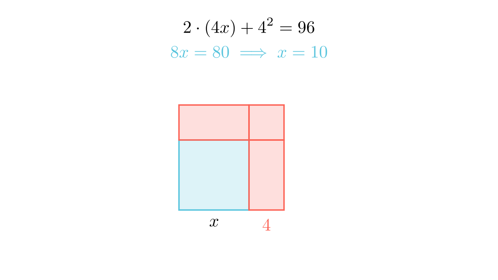

[⬅️ Назад кон Индексот](../../README.md) | [🧰 Skill: algebraic_manipulation](../../../tools/skill_guides/algebraic_manipulation.md)

# Зголемување на квадрат

## 📝 Текст на задачата
Ако страната на еден квадрат се зголеми за 4 dm, тогаш неговата плоштина ќе се зголеми за $9600 \text{ cm}^2$. Определи ја страната на квадратот во dm.

## 📐 Скица

> **👨‍💻 Geo-Mentor Code:**
> Одете во `assets/manim_code_log.md`, копирајте го кодот за `Task_2022_mun_g7_7` и генерирајте ја сликата.

> **👨‍💻 Geo-Mentor Code:**
> Одете во `assets/manim_code_log.md`, копирајте го кодот за `Task_2022_mun_g7_7` и генерирајте ја сликата.

## 🧠 Анализа
**Зошто е оваа задача тешка?**
Внимавајте на мерните единици! Претворете сè во дециметри. $9600 \text{ cm}^2 = 96 \text{ dm}^2$. Нека страната е $x$. Новата плоштина е $(x+4)^2$. Разликата е 96.

**Конструктивен потег:**
Внимавајте на мерните единици! Претворете сè во дециметри. $9600 \text{ cm}^2 = 96 \text{ dm}^2$. Нека страната е $x$. Новата плоштина е $(x+4)^2$. Разликата е 96.

## 💡 Решение

👀 Прикажи го решението

**Чекор 1: Претворање мерни единици**
$1 \text{ dm} = 10 \text{ cm}$, па $1 \text{ dm}^2 = 100 \text{ cm}^2$.
$$ 9600 \text{ cm}^2 = 9600 : 100 = 96 \text{ dm}^2 $$

**Чекор 2: Поставување равенка**
Стара плоштина: $P = x^2$.
Нова плоштина: $P_{new} = (x+4)^2$.
Разлика: $P_{new} - P = 96$.
$$ (x+4)^2 - x^2 = 96 $$

**Чекор 3: Решавање**
Геометриски, разликата се состои од два правоаголници $4 \times x$ и еден квадрат $4 \times 4$.
$$ 2 \cdot (4x) + 4^2 = 96 $$
$$ 8x + 16 = 96 $$
$$ 8x = 80 $$
$$ x = 10 \text{ dm} $$

Одговор: Страната е 10 dm.

## 🏁 Заклучок
<Краен резултат.>

## 👩‍🏫 За наставници
Геометриската визуелизација на $(x+a)^2 - x^2$ како L-форма (гномон) е многу покорисна за 7-мо одделение отколку алгебарската формула за квадрат на бином.