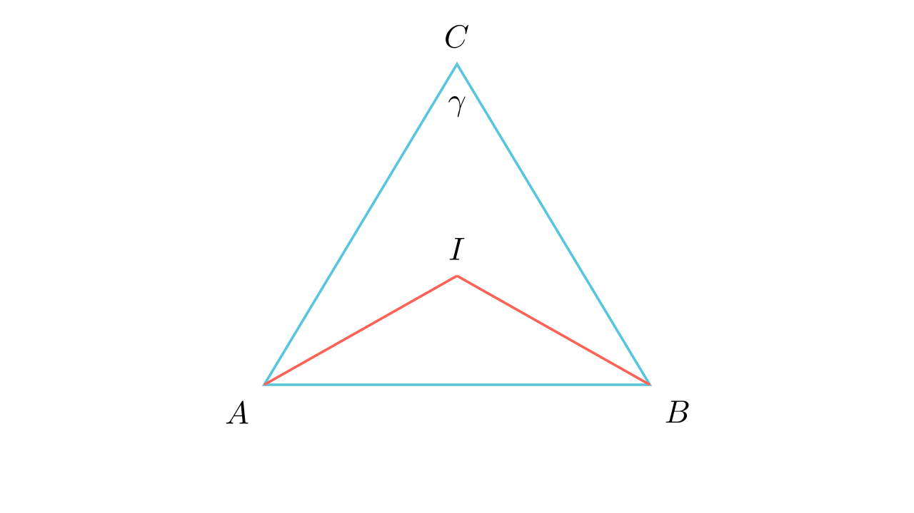

# Агол кај центарот на впишана кружница

## Текст на задачата
Нека $I$ е центарот на впишаната кружница во триаголникот $ABC$. Докажи дека аголот меѓу симетралите на аглите кај темињата $A$ и $B$ изнесува: $$\angle AIB = 90^\circ + \frac{\gamma}{2}$$ каде $\gamma$ е аголот кај темето $C$.

## 📐 Скица / Конструкција
<Опис на цртежот. Кои се клучните точки? Дали има помошни линии?>

## 🧠 Анализа
Клучот не е во наоѓање на поединечните агли $\alpha$ и $\beta$, туку во изразување на нивниот збир преку третиот агол $\gamma$.

## 📝 Решение (СИНТЕТИЧКО)
1. **Дефиниција:** Точката $I$ е пресек на симетралите, па во $\triangle AIB$ аглите се $\frac{\alpha}{2}$ и $\frac{\beta}{2}$. 
2. **Сума во $\triangle AIB$:** $\angle AIB = 180^\circ - (\frac{\alpha}{2} + \frac{\beta}{2}) = 180^\circ - \frac{\alpha + \beta}{2}$. 
3. **Врска со $\triangle ABC$:** Знаеме дека $\alpha + \beta = 180^\circ - \gamma$. 
4. **Замена:** $\angle AIB = 180^\circ - \frac{180^\circ - \gamma}{2} = 180^\circ - (90^\circ - \frac{\gamma}{2})$. 
5. **Резултат:** $\angle AIB = 90^\circ + \frac{\gamma}{2}$.

## ⚠️ Аналитички пристап (само ако е неизбежен)
<Ако мора да се користат координати, објасни зошто синтетичкиот пат е претежок.>

## 🏁 Заклучок
<Краен резултат.>