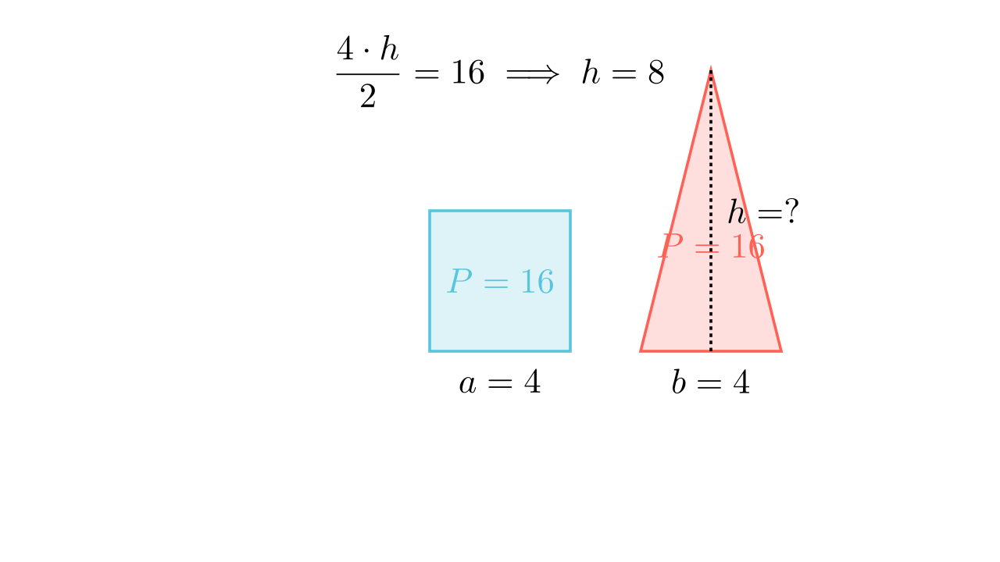

[⬅️ Назад кон Индексот](../../README.md) | [🧰 Skill: algebraic_manipulation](../../../tools/skill_guides/algebraic_manipulation.md)

# Квадрат и триаголник

## 📝 Текст на задачата
Должината на основата на рамнокрак триаголник е еднаква на должината на страната на квадрат со плоштина $16 \text{ cm}^2$. Колку изнесува должината на висината спуштена кон основата на триаголникот, ако квадратот и триаголникот имаат еднаква плоштина?

## 📐 Скица

> **👨‍💻 Geo-Mentor Code:**
> Одете во `assets/manim_code_log.md`, копирајте го кодот за `Task_2022_mun_g8_2` и генерирајте ја сликата.

> **👨‍💻 Geo-Mentor Code:**
> Одете во `assets/manim_code_log.md`, копирајте го кодот за `Task_2022_mun_g8_2` и генерирајте ја сликата.

## 🧠 Анализа
**Зошто е оваа задача тешка?**
Прво најдете ја страната на квадратот ($a^2=16$). Таа е иста со основата на триаголникот ($b=a$). Потоа изедначете ги плоштините ($P_{kv} = P_{tr}$) и најдете ја висината $h$.

**Конструктивен потег:**
Прво најдете ја страната на квадратот ($a^2=16$). Таа е иста со основата на триаголникот ($b=a$). Потоа изедначете ги плоштините ($P_{kv} = P_{tr}$) и најдете ја висината $h$.

## 💡 Решение

👀 Прикажи го решението

**Чекор 1: Страна на квадратот**
$P_{kv} = a^2 = 16 \implies a = 4$ cm.

**Чекор 2: Димензии на триаголникот**
Основата е $b = a = 4$ cm.
Плоштината е $P_{tr} = 16$ cm² (иста со квадратот).

**Чекор 3: Пресметка на висината**
$$ P_{tr} = \frac{b \cdot h}{2} $$
$$ 16 = \frac{4 \cdot h}{2} $$
$$ 16 = 2h $$
$$ h = 8 \text{ cm} $$

Одговор: 8 cm.

## 🏁 Заклучок
<Краен резултат.>

## 👩‍🏫 За наставници
Едноставна задача за поврзување на формули за плоштина.