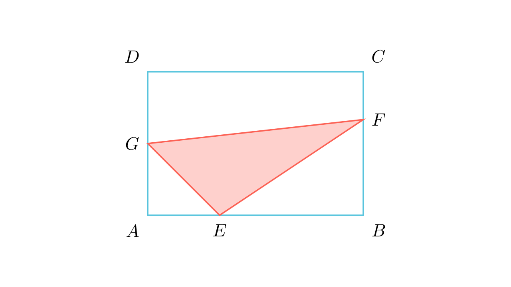

# Плоштина на впишан триаголник во правоаголник

## Текст на задачата
Во правоаголник $ABCD$ со периметар $60$ cm, важи $BC = \frac{2}{3}AB$. На страната $AB$ дадена е точка $E$ така што $AE = \frac{1}{3}AB$, а на страната $BC$ дадена е точка $F$ така што $BF = \frac{2}{3}BC$. Ако точката $G$ е средина на отсечката $AD$, колку изнесува плоштината на триаголникот $EFG$?

## 📐 Скица / Конструкција
<Опис на цртежот. Кои се клучните точки? Дали има помошни линии?>

## 🧠 Анализа
Најсигурен пат до решението е методот на комплементарни плоштини: одземи ги трите правоаголни триаголници во ќошевите од вкупната плоштина.

## 📝 Решение (СИНТЕТИЧКО)
1. **Димензии:** Од $2(a + \frac{2}{3}a) = 60$ следува $a=18$ cm и $b=12$ cm. 
2. **Отсечки:** $AE=6, EB=12, BF=8, FC=4, AG=GD=6$. 
3. **Одземање:** 
- $P_{AGE} = \frac{6 \cdot 6}{2} = 18$ 
- $P_{EBF} = \frac{12 \cdot 8}{2} = 48$ 
- $P_{GDCF} = \frac{6+4}{2} \cdot 18 = 90$ 
4. **Резултат:** $P_{EFG} = (18 \cdot 12) - (18 + 48 + 90) = 216 - 156 = 60$ cm$^2$.

## ⚠️ Аналитички пристап (само ако е неизбежен)
<Ако мора да се користат координати, објасни зошто синтетичкиот пат е претежок.>

## 🏁 Заклучок
<Краен резултат.>