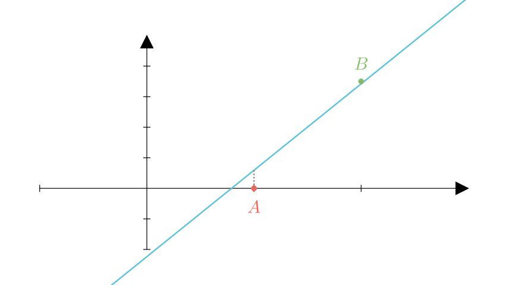

[⬅️ Назад кон Индексот](../../README.md) | [🧰 Skill: logic](../../../tools/skill_guides/logic.md)

# Позиција на точки во однос на права

## 📝 Текст на задачата
Точките $A(1; 0)$ и $B(2; 3.5)$ се распоредени во однос на правата $y = 2\sqrt{2}x - \sqrt{5}$ на одреден начин. Одреди ја нивната положба.

## 📐 Скица

> **👨‍💻 Geo-Mentor Code:**
> Одете во `assets/manim_code_log.md`, копирајте го кодот за `Task_cnt92_v2_14` и генерирајте ја сликата.

## 🧠 Анализа
**Зошто е оваа задача тешка?**
Споредете ја $y$-координатата на секоја точка со вредноста на функцијата $f(x)$ во таа точка. Користете апроксимации: $\sqrt{2} \approx 1.41$, $\sqrt{5} \approx 2.24$.

**Конструктивен потег:**
Споредете ја $y$-координатата на секоја точка со вредноста на функцијата $f(x)$ во таа точка. Користете апроксимации: $\sqrt{2} \approx 1.41$, $\sqrt{5} \approx 2.24$.

## 💡 Решение

👀 Прикажи го решението

Функцијата е $f(x) = 2\sqrt{2}x - \sqrt{5}$.

**Чекор 1: Проверка за точката $A(1, 0)$**

$$ f(1) = 2\sqrt{2}(1) - \sqrt{5} \approx 2(1.414) - 2.236 = 2.828 - 2.236 = 0.592 $$

Бидејќи $y_A = 0$ и $0 < 0.592$, точката $A$ е **под** правата.

**Чекор 2: Проверка за точката $B(2, 3.5)$**

$$ f(2) = 2\sqrt{2}(2) - \sqrt{5} = 4\sqrt{2} - \sqrt{5} $$

$$ f(2) \approx 4(1.414) - 2.236 = 5.656 - 2.236 = 3.42 $$

Бидејќи $y_B = 3.5$ и $3.5 > 3.42$, точката $B$ е **над** правата.

**Заклучок:** $A$ е долу, $B$ е горе (Опција 3).

## 🏁 Заклучок
<Краен резултат.>

## 👩‍🏫 За наставници
Внимавајте на прецизноста при апроксимација. Ако $y_B$ беше 3.45, ќе требаше попрецизна пресметка.