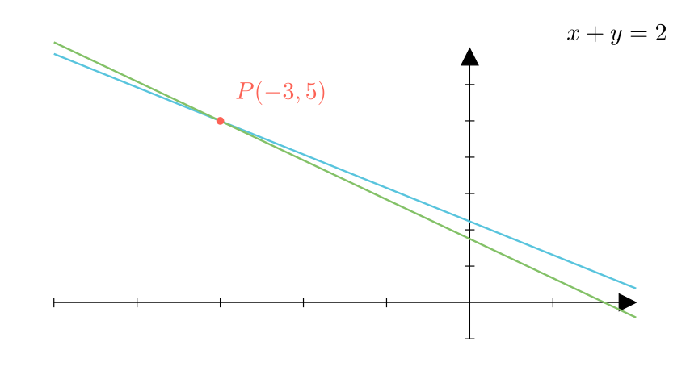

[⬅️ Назад кон Индексот](../../README.md) | [🧰 Skill: logic](../../../tools/skill_guides/logic.md)

# Пресек на прави со децимални коефициенти

## 📝 Текст на задачата
Збирот на координатите на пресечната точка на правите $y = -\frac{1.2}{1.3}x + \frac{2.9}{1.3}$ и $y = -\frac{1.3}{1.2}x + \frac{0.7}{0.4}$ е еднаков на...

## 📐 Скица

> **👨‍💻 Geo-Mentor Code:**
> Одете во `assets/manim_code_log.md`, копирајте го кодот за `Task_cnt92_v2_20` и генерирајте ја сликата.

> **👨‍💻 Geo-Mentor Code:**
> Одете во `assets/manim_code_log.md`, копирајте го кодот за `Task_cnt92_v2_20` и генерирајте ја сликата.

## 🧠 Анализа
**Зошто е оваа задача тешка?**
Прв чекор: ослободете се од децималните запирки во дропките. На пример, $\frac{1.2}{1.3} = \frac{12}{13}$. Внимавајте на втората равенка: $\frac{0.7}{0.4} = \frac{7}{4}$. Потоа изедначете ги равенките.

**Конструктивен потег:**
Прв чекор: ослободете се од децималните запирки во дропките. На пример, $\frac{1.2}{1.3} = \frac{12}{13}$. Внимавајте на втората равенка: $\frac{0.7}{0.4} = \frac{7}{4}$. Потоа изедначете ги равенките.

## 💡 Решение

👀 Прикажи го решението

Равенките се:
1. $y = -\frac{12}{13}x + \frac{29}{13}$
2. $y = -\frac{13}{12}x + \frac{7}{4}$

**Чекор 1: Изедначување**

$$ -\frac{12}{13}x + \frac{29}{13} = -\frac{13}{12}x + \frac{7}{4} $$

Множиме со НЗС(13, 12, 4) = $13 \cdot 12 = 156$:

$$ 12(-12x) + 12(29) = 13(-13x) + 39(7) $$

$$ -144x + 348 = -169x + 273 $$

**Чекор 2: Решавање по $x$**

$$ 169x - 144x = 273 - 348 $$

$$ 25x = -75 \implies x = -3 $$

**Чекор 3: Наоѓање на $y$**
Заменуваме во првата равенка:

$$ y = -\frac{12}{13}(-3) + \frac{29}{13} = \frac{36 + 29}{13} = \frac{65}{13} = 5 $$

**Чекор 4: Збир на координати**

$$ x + y = -3 + 5 = 2 $$

Одговор: Опција 2.

## 🏁 Заклучок
<Краен резултат.>

## 👩‍🏫 За наставници
Користењето на НЗС за елиминирање на дропките е многу посигурен метод од работа со децимали или собирање дропки во секој чекор.