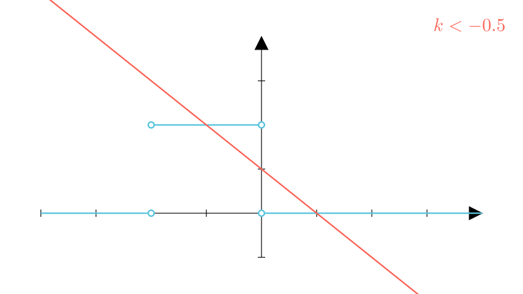

[⬅️ Назад кон Индексот](../../README.md) | [🧰 Skill: logic](../../../tools/skill_guides/logic.md)

# Систем равенки со параметар

## 📝 Текст на задачата
Системот равенки $\begin{cases} y = -\frac{|x|}{x} + \frac{|x+2|}{x+2} \\ y = kx + 1 \end{cases}$ има две решенија за сите $k$ од интервалот...

## 📐 Скица

> **👨‍💻 Geo-Mentor Code:**
> Одете во `assets/manim_code_log.md`, копирајте го кодот за `Task_cnt92_v2_26` и генерирајте ја сликата.

## 🧠 Анализа
**Зошто е оваа задача тешка?**
Решете графички. Првата функција е скалеста (со вредности 0 и 2). Втората е права што ротира околу $(0, 1)$. Бараме правата да го пресече графикот на првата функција на две места.

**Конструктивен потег:**
Решете графички. Првата функција е скалеста (со вредности 0 и 2). Втората е права што ротира околу $(0, 1)$. Бараме правата да го пресече графикот на првата функција на две места.

## 💡 Решение

👀 Прикажи го решението

**Чекор 1: Анализа на $f(x) = -\text{sgn}(x) + \text{sgn}(x+2)$**
*   $x < -2$: $-(-1) + (-1) = 0$.
*   $-2 < x < 0$: $-(-1) + 1 = 2$.
*   $x > 0$: $-(1) + 1 = 0$.
Графикот има „скалило“ на висина $y=2$ помеѓу $x=-2$ и $x=0$, и е $y=0$ инаку.

**Чекор 2: Анализа на правата**
Правата $y=kx+1$ минува низ $P(0, 1)$.
За да има 2 решенија, мора да пресече:
1.  Средниот дел ($y=2$ за $x \in (-2, 0)$).
2.  Еден од страничните делови (во овој случај десниот, $y=0$ за $x>0$).

**Чекор 3: Геометриски услови**
*   За да го погоди средниот дел (сегментот од $(-2, 2)$ до $(0, 2)$), правата мора да оди „горе-лево“. Граничниот наклон кон $(-2, 2)$ е $k = \frac{2-1}{-2-0} = -0.5$. Значи $k < -0.5$.
*   За да го погоди десниот дел ($y=0$ за $x>0$), правата мора да оди „долу-десно“ или „долу-лево“? Пресекот со $y=0$ е $x = -1/k$. За $x>0$, треба $-1/k > 0 \implies k < 0$.

**Заклучок:**
Условот $k < -0.5$ ги задоволува и двете барања (пресек со средниот и десниот дел). 
Од понудените опции, интервалот $(-5; -2)$ (Опција 4) е целосно содржан во $k < -0.5$.

## 🏁 Заклучок
<Краен резултат.>

## 👩‍🏫 За наставници
Графичкиот метод е супериорен овде. Алгебарското решавање со 3 случаи е многу покомплицирано и подложно на грешки.