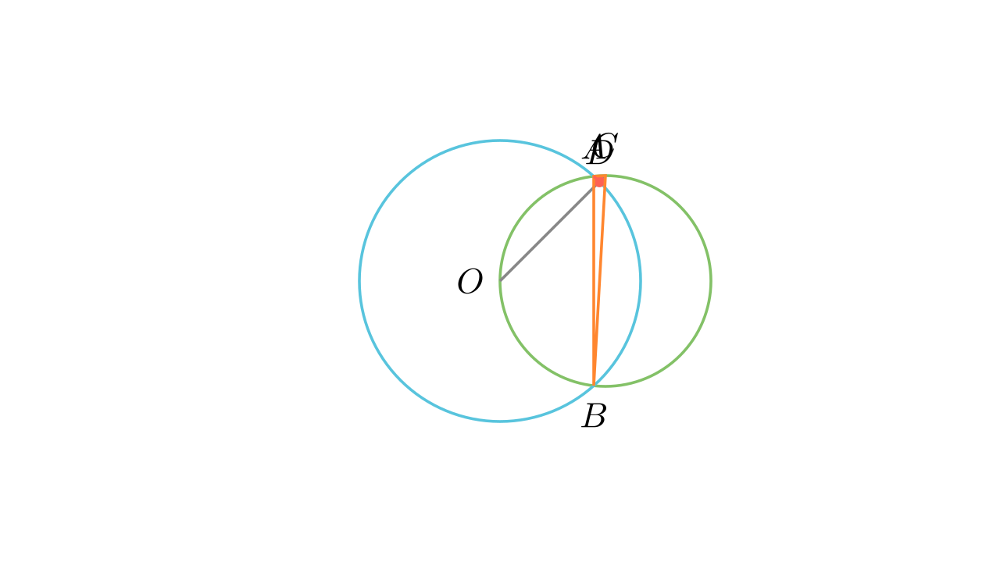

# Пресечни кружници и центар на впишана кружница

## Текст на задачата
Нека кружниците $k_1$ и $k_2$ се сечат во точките $A$ и $B$ така што центарот $O$ на кружницата $k_2$ лежи на $k_1$. Нека $C$ е точка од лакот $AB$ на $k_1$ кој не ја содржи $O$. Отсечката $OC$ ја сече $k_2$ во точката $D$. Докажи дека $D$ е центар на впишаната кружница во $\triangle ABC$.

## 📐 Скица / Конструкција
<Опис на цртежот. Кои се клучните точки? Дали има помошни линии?>

## 🧠 Анализа
Покажи дека $D$ е точката каде се сечат симетралите на аглите. Искористи го фактот дека $OA=OB=OD$ се радиуси на $k_2$.

## 📝 Решение (СИНТЕТИЧКО)
1. **Симетрала на C:** Бидејќи $OA=OB$ (радиуси на $k_2$), тетивите $OA$ и $OB$ во $k_1$ се еднакви, па перифериските агли над нив $\angle ACO$ и $\angle BCO$ се еднакви. Значи $CD$ е симетрала на $\angle C$.
2. **Аголни релации:** Во тетивниот четириаголник $OACB$ на $k_1$, $\angle AOB = 180^\circ - \gamma$. Во рамнокракиот $\triangle OAB$, $\angle OAB = \gamma/2$.
3. **Рамнокрак триаголник OAD:** Бидејќи $OA=OD$ (радиуси на $k_2$), $\angle OAD = \angle ODA$. Аголот $\angle ODA$ е надворешен за $\triangle ADC$, па $\angle ODA = \angle DAC + \gamma/2$.
4. **Симетрала на A:** Од $\angle OAD = \angle OAB + \angle BAD$, добиваме $\gamma/2 + \angle BAD = \angle DAC + \gamma/2$, па $\angle BAD = \angle DAC$.
5. **Заклучок:** $D$ е пресек на симетралите на аглите $A$ и $C$, па $D$ е инцентар.

## ⚠️ Аналитички пристап (само ако е неизбежен)
<Ако мора да се користат координати, објасни зошто синтетичкиот пат е претежок.>

## 🏁 Заклучок
<Краен резултат.>