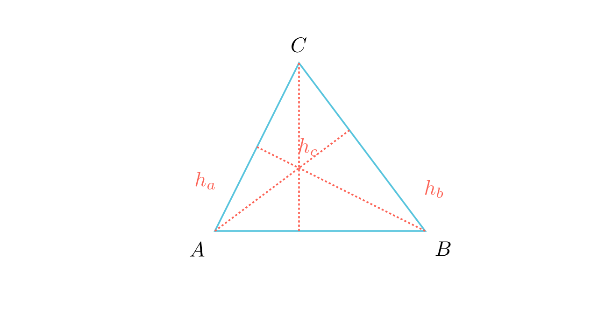

# Периметар преку релација на висини

## Текст на задачата
За висините во триаголникот $ABC$ важи $h_c = h_a + h_b$. Ако $a=4$ dm, $b=6$ dm, пресметај го периметарот на $ABC$.

## 📐 Скица / Конструкција
<Опис на цртежот. Кои се клучните точки? Дали има помошни линии?>

## 🧠 Анализа
Изрази ги сите висини преку плоштината $P$ и соодветните страни ($h_a = 2P/a$).

## 📝 Решение (СИНТЕТИЧКО)
1. Од $h_c = h_a + h_b$ заменуваме $\frac{2P}{c} = \frac{2P}{a} + \frac{2P}{b}$. 
2. Делиме со $2P$ и добиваме: $\frac{1}{c} = \frac{1}{a} + \frac{1}{b}$. 
3. Со замена на $a=4, b=6$: $\frac{1}{c} = \frac{1}{4} + \frac{1}{6} = \frac{5}{12}$. 
4. $c = \frac{12}{5} = 2.4$ dm. 
5. $L = 4 + 6 + 2.4 = 12.4$ dm.

## ⚠️ Аналитички пристап (само ако е неизбежен)
<Ако мора да се користат координати, објасни зошто синтетичкиот пат е претежок.>

## 🏁 Заклучок
<Краен резултат.>