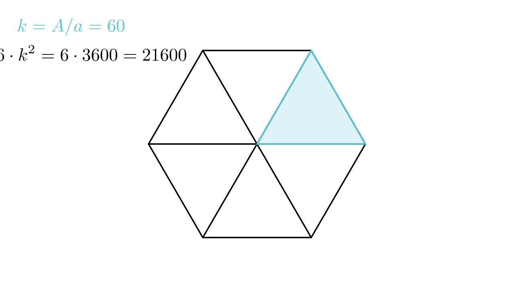

[⬅️ Назад кон Индексот](../../README.md) | [🧰 Skill: visual_reasoning](../../../tools/skill_guides/visual_reasoning.md)

# Поплочување на шестаголник

## 📝 Текст на задачата
Спортски терен има форма на правилен шестаголник со страна $A = 20.22$ m. Треба да се поплочи со плочки во форма на рамностран триаголник со страна $a = 3.37$ dm. Колку плочки се потребни?

## 📐 Скица

> **👨‍💻 Geo-Mentor Code:**
> Одете во `assets/manim_code_log.md`, копирајте го кодот за `Task_2022_mun_g9_5` и генерирајте ја сликата.

> **👨‍💻 Geo-Mentor Code:**
> Одете во `assets/manim_code_log.md`, копирајте го кодот за `Task_2022_mun_g9_5` и генерирајте ја сликата.

## 🧠 Анализа
**Зошто е оваа задача тешка?**
Правилен шестаголник се состои од 6 рамнострани триаголници со страна $A$. Плочката е мал рамностран триаголник со страна $a$. Бројот на плочки е односот на плоштините. Бидејќи формите се слични (триаголници), односот на плоштините е квадрат од односот на страните. Внимавајте на мерните единици!

**Конструктивен потег:**
Правилен шестаголник се состои од 6 рамнострани триаголници со страна $A$. Плочката е мал рамностран триаголник со страна $a$. Бројот на плочки е односот на плоштините. Бидејќи формите се слични (триаголници), односот на плоштините е квадрат од односот на страните. Внимавајте на мерните единици!

## 💡 Решение

👀 Прикажи го решението

**Чекор 1: Усогласување на единиците**
$A = 20.22 \text{ m} = 202.2 \text{ dm}$.
$a = 3.37 \text{ dm}$.

**Чекор 2: Однос на страните**
Колку пати страната на големиот триаголник (кој е 1/6 од шестаголникот) е поголема од страната на плочката?
$$ k = \frac{A}{a} = \frac{202.2}{3.37} $$
Да провериме дали се дели: $3.37 \cdot 6 = 20.22$. Значи $3.37 \cdot 60 = 202.2$.
$$ k = 60 $$

**Чекор 3: Број на плочки во еден голем триаголник**
Бидејќи се слични триаголници, бројот на мали во голем е $k^2$.
$$ N_1 = 60^2 = 3600 $$

**Чекор 4: Вкупен број плочки**
Шестаголникот има 6 такви големи триаголници.
$$ N_{vk} = 6 \cdot N_1 = 6 \cdot 3600 = 21600 $$

Одговор: 21600 плочки.

## 🏁 Заклучок
<Краен резултат.>

## 👩‍🏫 За наставници
Може да се користи и формула за плоштина, но односот на сличност е многу побрз и поелегантен.