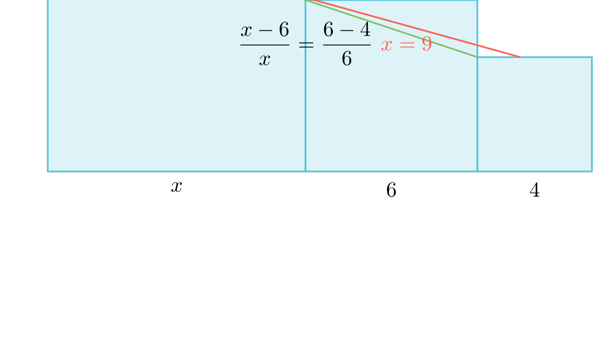

[⬅️ Назад кон Индексот](../../README.md) | [🧰 Skill: similarity](../../../tools/skill_guides/similarity.md)

# Колинеарни квадрати

## 📝 Текст на задачата
Три квадрати со различна големина се поставени еден до друг на права линија. Нивните горни леви темиња $X, Y, Z$ се колинеарни (лежат на иста права). Ако страните на двата помали квадрати се 4 cm и 6 cm, одреди ја страната на најголемиот квадрат.

## 📐 Скица

> **👨‍💻 Geo-Mentor Code:**
> Одете во `assets/manim_code_log.md`, копирајте го кодот за `Task_2022_mun_y1_6a` и генерирајте ја сликата.

> **👨‍💻 Geo-Mentor Code:**
> Одете во `assets/manim_code_log.md`, копирајте го кодот за `Task_2022_mun_y1_6a` и генерирајте ја сликата.

## 🧠 Анализа
**Зошто е оваа задача тешка?**
Колинеарноста на темињата значи дека наклонот (стръмноста) на правата што ги поврзува е константен. Формирајте правоаголни триаголници над квадратите и искористете ја сличноста (или талесова теорема). Односот $\frac{\text{разлика во висина}}{\text{ширина}}$ мора да биде ист.

**Конструктивен потег:**
Колинеарноста на темињата значи дека наклонот (стръмноста) на правата што ги поврзува е константен. Формирајте правоаголни триаголници над квадратите и искористете ја сличноста (или талесова теорема). Односот $\frac{\text{разлика во висина}}{\text{ширина}}$ мора да биде ист.

## 💡 Решение

👀 Прикажи го решението

**Чекор 1: Поставување на проблемот**
Нека страните на квадратите се $x$ (најголем), $6$ (среден) и $4$ (најмал). Тие се наредени по големина.
Ширините се $x, 6, 4$. Висините на темињата се исто така $x, 6, 4$.

**Чекор 2: Сличност на триаголници**
Разликата во висина меѓу првиот и вториот квадрат е $x - 6$. Хоризонталното растојание е ширината на првиот квадрат, $x$.
Разликата во висина меѓу вториот и третиот квадрат е $6 - 4 = 2$. Хоризонталното растојание е ширината на вториот квадрат, $6$.

Поради колинеарноста, односот (наклонот) е ист:
$$ \frac{x - 6}{x} = \frac{6 - 4}{6} $$

**Чекор 3: Решавање на равенката**
$$ \frac{x - 6}{x} = \frac{2}{6} = \frac{1}{3} $$
Множиме вкрстено:
$$ 3(x - 6) = x $$
$$ 3x - 18 = x $$
$$ 2x = 18 $$
$$ x = 9 \text{ cm} $$

Одговор: 9.

## 🏁 Заклучок
<Краен резултат.>

## 👩‍🏫 За наставници
Оваа конфигурација секогаш води до геометриска прогресија: $x, 6, 4$ се во ГП ако $6^2 = 4x$. $36 = 4x \implies x=9$.