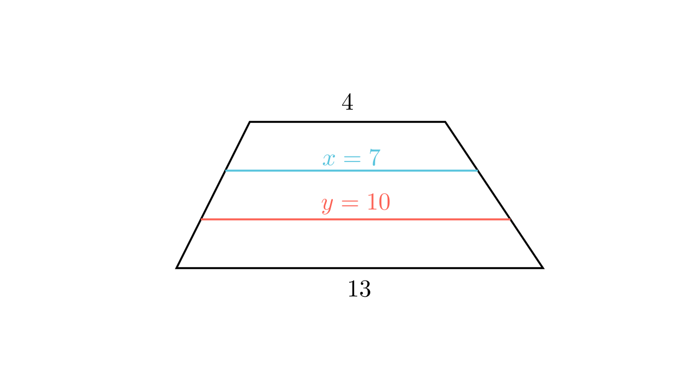

[⬅️ Назад кон Индексот](../../README.md) | [🧰 Skill: similarity](../../../tools/skill_guides/similarity.md)

# Паралелни пресеци во трапез

## 📝 Текст на задачата
Правите $p$ и $q$ се паралелни со основите на трапезот $ABCD$ ($AB=13, CD=4$) и го делат кракот $AD$ на три еднакви дела. Најди ги должините на отсечките $x$ и $y$ кои краците ги отсекуваат од правите $p$ и $q$.

## 📐 Скица

> **👨‍💻 Geo-Mentor Code:**
> Одете во `assets/manim_code_log.md`, копирајте го кодот за `Task_2023_mun_y1_4ab` и генерирајте ја сликата.

> **👨‍💻 Geo-Mentor Code:**
> Одете во `assets/manim_code_log.md`, копирајте го кодот за `Task_2023_mun_y1_4ab` и генерирајте ја сликата.

## 🧠 Анализа
**Зошто е оваа задача тешка?**
Ова е генерализација на средна линија. Ако кракот е поделен на $n$ еднакви делови, должините на паралелните отсечки формираат аритметичка прогресија. Разликата меѓу основите ($13-4=9$) се „распоредува“ рамномерно на 3 чекори.

**Конструктивен потег:**
Ова е генерализација на средна линија. Ако кракот е поделен на $n$ еднакви делови, должините на паралелните отсечки формираат аритметичка прогресија. Разликата меѓу основите ($13-4=9$) се „распоредува“ рамномерно на 3 чекори.

## 💡 Решение

👀 Прикажи го решението

**Чекор 1: Анализа на прогресијата**
Должините на паралелните отсечки во трапез растат линеарно (аритметичка прогресија) ако краците се поделени на еднакви делови.
Имаме низа: $CD, x, y, AB$.
Број на интервали: 3 (бидејќи кракот е поделен на 3 дела).
Разлика во должина: $AB - CD = 13 - 4 = 9$.

**Чекор 2: Пресметка на чекорот (d)**
Чекорот на зголемување е $d = \frac{9}{3} = 3$.

**Чекор 3: Наоѓање на $x$ и $y$**
*   $x$ (поблиску до $CD$): $x = CD + d = 4 + 3 = 7$.
*   $y$ (поблиску до $AB$): $y = x + d = 7 + 3 = 10$.
    (Проверка: $y + d = 10 + 3 = 13 = AB$. Точно).

**Алтернативен метод (Сличност):**
Повлекуваме права низ $D$ паралелна со $BC$. Таа формира паралелограм со ширина 4 и триаголник со основа $13-4=9$. Триаголникот е поделен на 3 дела. Отсечките во триаголникот се $1/3$ од 9 (т.е. 3) и $2/3$ од 9 (т.е. 6). Вкупните должини се $4+3=7$ и $4+6=10$.

## 🏁 Заклучок
<Краен резултат.>

## 👩‍🏫 За наставници
Интуицијата за „линеарен раст“ кај трапезот е многу корисна. Тоа е како скалила.