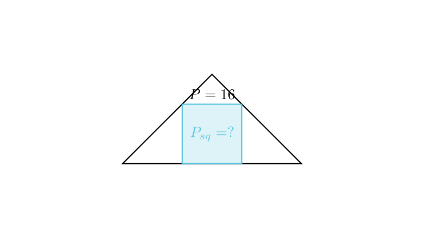

[⬅️ Назад кон Индексот](../../README.md) | [🧰 Skill: logic](../../../tools/skill_guides/logic.md)

# Квадрат впишан во триаголник

## 📝 Текст на задачата
Во триаголникот $ABC$ е впишан квадрат $DEFG$ така што $DE$ лежи на $AB$. Ако $AD + EB = 16$ cm и плоштината на триаголникот $GCF$ (над квадратот) е 16 cm², пресметај ја плоштината на квадратот.

## 📐 Скица

> **👨‍💻 Geo-Mentor Code:**
> Одете во `assets/manim_code_log.md`, копирајте го кодот за `Task_2025_mun_g9_4` и генерирајте ја сликата.

> **👨‍💻 Geo-Mentor Code:**
> Одете во `assets/manim_code_log.md`, копирајте го кодот за `Task_2025_mun_g9_4` и генерирајте ја сликата.

## 🧠 Анализа
**Зошто е оваа задача тешка?**
Нека страната на квадратот е $x$. Висината на $\triangle ABC$ е $h$. Висината на малиот триаголник $\triangle GCF$ е $h-x$. Од сличност $\triangle GCF \sim \triangle ABC$, односот на основите е еднаков на односот на висините: $\frac{x}{c} = \frac{h-x}{h}$. Но, тука е подобро да се работи со деловите. $c = AD + x + EB = 16 + x$.

**Конструктивен потег:**
Нека страната на квадратот е $x$. Висината на $\triangle ABC$ е $h$. Висината на малиот триаголник $\triangle GCF$ е $h-x$. Од сличност $\triangle GCF \sim \triangle ABC$, односот на основите е еднаков на односот на висините: $\frac{x}{c} = \frac{h-x}{h}$. Но, тука е подобро да се работи со деловите. $c = AD + x + EB = 16 + x$.

## 💡 Решение

👀 Прикажи го решението

**Чекор 1: Ознаки**
Нека страната на квадратот е $x$. Тогаш $GF=x$.
Основата на триаголникот е $c = AB = AD + DE + EB = (AD+EB) + x = 16 + x$.
Нека $h$ е висината на $\triangle ABC$ кон $AB$. Висината на $\triangle GCF$ е $h_1 = h - x$.

**Чекор 2: Плоштина на $\triangle GCF$**
Дадено е $P_{GCF} = 16$.

$$ \frac{1}{2} \cdot GF \cdot h_1 = 16 \implies \frac{1}{2} x (h-x) = 16 \implies x(h-x) = 32 $$

Од тука $h-x = \frac{32}{x}$, па $h = x + \frac{32}{x} = \frac{x^2+32}{x}$.

**Чекор 3: Сличност**
$\triangle GCF \sim \triangle ABC$. Односот на висините е еднаков на односот на основите:

$$ \frac{h-x}{h} = \frac{GF}{AB} = \frac{x}{16+x} $$

**Чекор 4: Решавање на равенката**
Заменуваме $h-x = \frac{32}{x}$ и $h = \frac{x^2+32}{x}$:

$$ \frac{32/x}{(x^2+32)/x} = \frac{x}{16+x} $$

$$ \frac{32}{x^2+32} = \frac{x}{16+x} $$

Множиме вкрстено:

$$ 32(16+x) = x(x^2+32) $$

$$ 512 + 32x = x^3 + 32x $$

Членовите $32x$ се поништуваат!

$$ x^3 = 512 $$

$$ x = \sqrt[3]{512} = 8 \text{ cm} $$

**Чекор 5: Плоштина на квадратот**

$$ P = x^2 = 8^2 = 64 \text{ cm}^2 $$

## 🏁 Заклучок
<Краен резултат.>

## 👩‍🏫 За наставници
Поништувањето на линеарниот член ($32x$) е знак дека задачата е добро поставена. Ако учениците добијат комплицирана кубна равенка, веројатно некаде згрешиле.