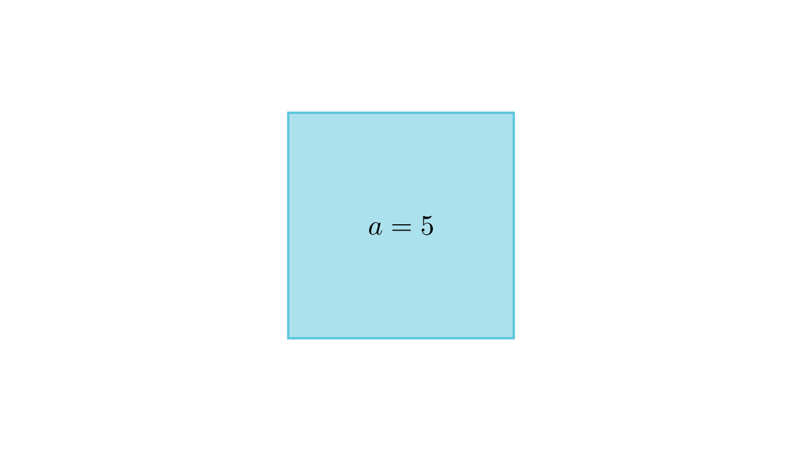

[⬅️ Назад кон Индексот](../../README.md) | [🧰 Skill: logic](../../../tools/skill_guides/logic.md)

# Тест задача за автоматизација

## 📝 Текст на задачата
Ова е тест задача за да провериме дали новиот workflow работи. Пресметај ја плоштината на квадрат со страна $a=5$.

## 📐 Скица

> **👨‍💻 Geo-Mentor Code:**
> Одете во `assets/manim_code_log.md`, копирајте го кодот за `Task_2025_mun_g9_5` и генерирајте ја сликата.

> **👨‍💻 Geo-Mentor Code:**
> Одете во `assets/manim_code_log.md`, копирајте го кодот за `Task_2025_mun_g9_5` и генерирајте ја сликата.

## 🧠 Анализа
**Зошто е оваа задача тешка?**
Користи ја формулата $P=a^2$.

**Конструктивен потег:**
Користи ја формулата $P=a^2$.

## 💡 Решение

👀 Прикажи го решението

**Чекор 1:**
Дадено е $a=5$.

$$ P = a^2 = 5^2 = 25 $$

## 🏁 Заклучок
<Краен резултат.>

## 👩‍🏫 За наставници
Тест.