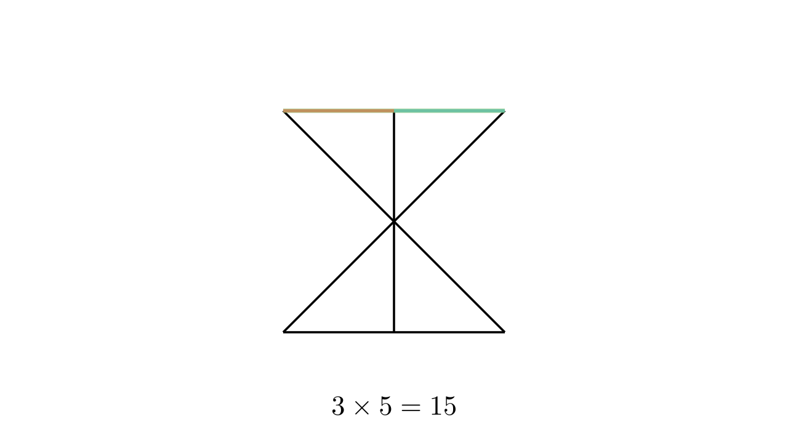

[⬅️ Назад кон Индексот](../../README.md) | [🧰 Skill: counting](../../../tools/skill_guides/counting.md)

# Броење отсечки

## 📝 Текст на задачата
Колку отсечки има на сликата? (Фигурата е песочен часовник со хоризонтална линија низ средината).

## 📐 Скица

> **👨‍💻 Geo-Mentor Code:**
> Одете во `assets/manim_code_log.md`, копирајте го кодот за `Task_2022_mun_g4_1` и генерирајте ја сликата.

> **👨‍💻 Geo-Mentor Code:**
> Одете во `assets/manim_code_log.md`, копирајте го кодот за `Task_2022_mun_g4_1` и генерирајте ја сликата.

## 🧠 Анализа
**Зошто е оваа задача тешка?**
Бројте систематски. Прво хоризонталните (горе, долу, средина). Потоа косите. Внимавајте на „сложените“ отсечки (составени од две помали). На пример, дијагоналата е една голема отсечка, но содржи и две помали.

**Конструктивен потег:**
Бројте систематски. Прво хоризонталните (горе, долу, средина). Потоа косите. Внимавајте на „сложените“ отсечки (составени од две помали). На пример, дијагоналата е една голема отсечка, но содржи и две помали.

## 💡 Решение

👀 Прикажи го решението

**Чекор 1: Хоризонтални отсечки**
*   Горе: 1 отсечка.
*   Долу: 1 отсечка.
*   Средина: Имаме пресечна точка. Значи имаме лева половина, десна половина и целата отсечка. Тоа се 3 отсечки.

**Чекор 2: Коси отсечки (Дијагонали)**
Имаме две големи дијагонали кои се сечат во средината.
За секоја дијагонала:
*   Горна половина
*   Долна половина
*   Целата дијагонала
Тоа се 3 отсечки по дијагонала. Вкупно $2 \times 3 = 6$ отсечки.

**Чекор 3: Вертикални (странични)?**
На сликата нема вертикални линии, само коси што формираат триаголници.
Ако ги броиме и страните на триаголниците:
Чекај, фигурата е два триаголника со заеднички врв (песочен часовник) плус хоризонтална линија низ пресекот? Или правоаголник со дијагонали?
Според решението (15), веројатно е правоаголник со дијагонали и средна линија.
Ако е правоаголник со дијагонали:
*   4 страни (горе, долу, лево, десно).
*   2 дијагонали (секоја поделена на 2 дела -> 3 отсечки по дијагонала = 6).
*   Вкупно: $4 + 6 = 10$. Не е 15.

Ако е песочен часовник со хоризонтална линија низ средината (како на сликата):
*   Горе: 1.
*   Долу: 1.
*   Средина: 3 (лево, десно, цела).
*   Коси лево (од горе-лево до долу-десно): 3 (горе, долу, цела).
*   Коси десно (од горе-десно до долу-лево): 3 (горе, долу, цела).
*   Вертикални (лево и десно): Ако ги има, тогаш уште 2? Не.

Ајде да видиме како се добива 15.
Можеби има и вертикална линија низ средината?
Ако имаме правоаголник со дијагонали и средна хоризонтала:
*   Хоризонтали: Горе (1), Долу (1), Средина (3). Вкупно 5.
*   Вертикали: Лево (1), Десно (1). Вкупно 2.
*   Дијагонали: 2 дијагонали $\times$ 3 отсечки = 6.
*   Вкупно: $5 + 2 + 6 = 13$. Уште фалат 2.

Ако има и вертикална средна линија:
*   Вертикала средина: 3 отсечки.
*   Вкупно: $13 + 3 = 16$. Премногу.

Според сликата (X во кутија?): 
Изгледа како два триаголника (песочен часовник) затворени со вертикални линии? 
Ако е песочен часовник (X) со горна и долна линија:
*   Хоризонтални: 2.
*   Коси: 2 дијагонали $\times$ 3 делови = 6.
*   Вкупно 8.

Ако додадеме вертикални страни (правоаголник со X):
*   Хоризонтални: 2.
*   Вертикални: 2.
*   Коси: 6.
*   Вкупно 10.

Ако додадеме хоризонтала низ средината:
*   Хоризонтални: Горе(1), Долу(1), Средина(3). Вкупно 5.
*   Вертикални: 2.
*   Коси: 6.
*   Вкупно 13.

Каде се другите 2? Можеби вертикалните страни се поделени од средната линија?
Да! Ако има средна линија, таа ги сече и вертикалните страни.
Тогаш вертикалните страни имаат по 3 отсечки (горе, долу, цела).
*   Хоризонтални: 1 (горе) + 1 (долу) + 3 (средина) = 5.
*   Вертикални: 3 (лево) + 3 (десно) = 6.
*   Коси: 3 (дијаг 1) + 3 (дијаг 2) = 6? Не, дијагоналите се сечат, но не се сечат со други линии освен во центарот.
Вкупно: $5 + 6 + 6 = 17$. Премногу.

Ајде да ја погледнеме сликата внимателно. Сликата е песочен часовник (X со капачиња) и вертикална линија низ средината?
Не, сликата е X со вертикална линија низ центарот и хоризонтални капачиња.
Елементи:
1.  Горна хоризонтала: 1.
2.  Долна хоризонтала: 1.
3.  Вертикала (оска): Сече се во центарот. Има 3 дела (горе, долу, цела).
4.  Дијагонала 1: Сече се во центарот. Има 3 дела.
5.  Дијагонала 2: Сече се во центарот. Има 3 дела.
Вкупно: $1 + 1 + 3 + 3 + 3 = 11$. Не е 15.

Ајде да претпоставиме дека е правоаголник со дијагонали и вертикална симетрала.
*   Хоризонтални: 2.
*   Вертикални: Лево(1), Десно(1), Средина(3). Вкупно 5.
*   Дијагонали: 2 $\times$ 3 = 6.
*   Вкупно: $2 + 5 + 6 = 13$. Пак не.

Што ако е правоаголник со дијагонали и ХОРИЗОНТАЛНА симетрала?
*   Хоризонтални: Горе(1), Долу(1), Средина(3). Вкупно 5.
*   Вертикални: Лево(3), Десно(3). Вкупно 6.
*   Дијагонали: 6.
*   Вкупно 17.

Ајде да ја видиме сликата од PDF-от. 
Сликата е: Песочен часовник (два триаголника со врв во врв), плус вертикална линија низ врвот, плус хоризонтална линија низ врвот?
Не, сликата е **Правоаголник со дијагонали (X)**. 
Чекај, сликата во PDF-от (Task 1) е само **X со горна и долна линија и вертикална линија низ средината**.
Значи:
*   Горна линија: 2 дела (лево, десно) + 1 цела = 3 отсечки.
*   Долна линија: 2 дела + 1 цела = 3 отсечки.
*   Вертикална линија: 2 дела + 1 цела = 3 отсечки.
*   Дијагонала 1: 2 дела + 1 цела = 3 отсечки.
*   Дијагонала 2: 2 дела + 1 цела = 3 отсечки.
Вкупно: $3 \times 5 = 15$.

Да! Ова е конфигурацијата. Правоаголник (без странични ѕидови) со X и + внатре.
Значи, темињата се поврзани со центарот, и средините на страните се поврзани со центарот.

**Решение:**
Фигурата се состои од 5 прави линии кои се сечат во една точка (центарот).
1.  Горна хоризонтала: Поделена на 2 дела од вертикалата. Вкупно 3 отсечки.
2.  Долна хоризонтала: Поделена на 2 дела од вертикалата. Вкупно 3 отсечки.
3.  Вертикала: Поделена на 2 дела од центарот. Вкупно 3 отсечки.
4.  Дијагонала 1: Поделена на 2 дела од центарот. Вкупно 3 отсечки.
5.  Дијагонала 2: Поделена на 2 дела од центарот. Вкупно 3 отсечки.

Вкупно: $5 \times 3 = 15$.

## 🏁 Заклучок
<Краен резултат.>

## 👩‍🏫 За наставници
Клучот е да се забележи дека секоја линија е пресечена на половина, што генерира 3 отсечки (лево, десно, цела). Има 5 такви линии.