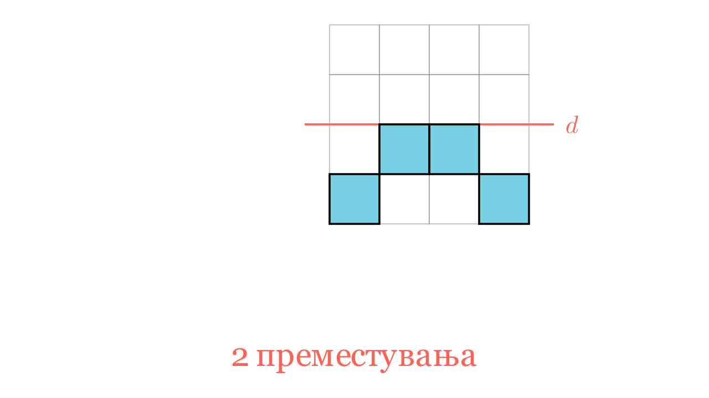

[⬅️ Назад кон Индексот](../../README.md) | [🧰 Skill: visual_reasoning](../../../tools/skill_guides/visual_reasoning.md)

# Осна симетрија

## 📝 Текст на задачата
Кој е најмалиот број мали квадратчиња во дадената фигура кои треба да се преместат за правата $d$ да биде оска на симетрија?

## 📐 Скица

> **👨‍💻 Geo-Mentor Code:**
> Одете во `assets/manim_code_log.md`, копирајте го кодот за `Task_2022_mun_g4_6` и генерирајте ја сликата.

> **👨‍💻 Geo-Mentor Code:**
> Одете во `assets/manim_code_log.md`, копирајте го кодот за `Task_2022_mun_g4_6` и генерирајте ја сликата.

## 🧠 Анализа
**Зошто е оваа задача тешка?**
Правата $d$ ја дели мрежата на два дела (горе и долу). За да има симетрија, секое квадратче што е обоено горе мора да има соодветно обоено квадратче долу (на иста оддалеченост од оската), и обратно. Идентификувајте ги „вишокот“ квадратчиња што немаат пар и преместете ги на празните места каде што фали пар.

**Конструктивен потег:**
Правата $d$ ја дели мрежата на два дела (горе и долу). За да има симетрија, секое квадратче што е обоено горе мора да има соодветно обоено квадратче долу (на иста оддалеченост од оската), и обратно. Идентификувајте ги „вишокот“ квадратчиња што немаат пар и преместете ги на празните места каде што фали пар.

## 💡 Решение

👀 Прикажи го решението

**Чекор 1: Анализа на симетријата**
Оската $d$ е хоризонтална.
Споредуваме горниот и долниот дел.
*   Горе имаме квадратчиња на позиции (да речеме) A и B.
*   Долу треба да имаме квадратчиња точно под нив.

**Чекор 2: Идентификување на разликите**
(Според решението од 2 квадратчиња):
Веројатно има 2 квадратчиња кои се на „погрешно“ место (на пример, горе лево, а долу фали лево, но има десно). 
Ако преместиме 2 квадратчиња од позициите каде што „штрчат“ (немаат пар од другата страна) на позициите каде што „фалат“ (за да направат пар со постоечките), ќе добиеме симетрија.

Одговор: 2 квадратчиња.

## 🏁 Заклучок
<Краен резултат.>

## 👩‍🏫 За наставници
Најдобро се решава со превиткување на хартијата по линијата $d$. Она што не се поклопува треба да се премести.