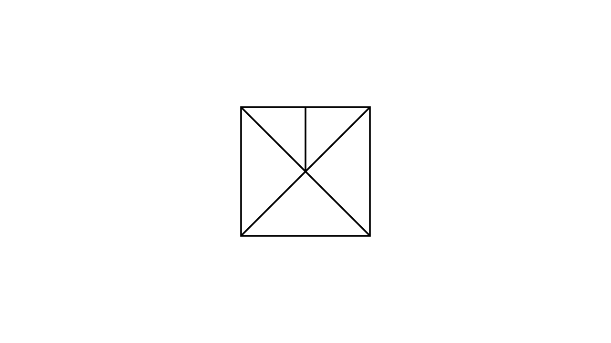

[⬅️ Назад кон Индексот](../../README.md) | [🧰 Skill: counting](../../../tools/skill_guides/counting.md)

# Броење триаголници

## 📝 Текст на задачата
Колку триаголници има на сликата? (Квадрат со дијагонали и дополнителни линии).

## 📐 Скица

> **👨‍💻 Geo-Mentor Code:**
> Одете во `assets/manim_code_log.md`, копирајте го кодот за `Task_2022_mun_g5_8` и генерирајте ја сликата.

> **👨‍💻 Geo-Mentor Code:**
> Одете во `assets/manim_code_log.md`, копирајте го кодот за `Task_2022_mun_g5_8` и генерирајте ја сликата.

## 🧠 Анализа
**Зошто е оваа задача тешка?**
Бројте систематски: 1. Мали (единечни) триаголници. 2. Триаголници составени од 2 дела. 3. Триаголници составени од 4 дела (четвртини од квадратот).

**Конструктивен потег:**
Бројте систематски: 1. Мали (единечни) триаголници. 2. Триаголници составени од 2 дела. 3. Триаголници составени од 4 дела (четвртини од квадратот).

## 💡 Решение

👀 Прикажи го решението

Според решението, вкупниот број е 11.
Ова сугерира специфична конфигурација (на пр. квадрат со дијагонали и еден впишан триаголник или сл.).

**Систематско броење (пример):**
1.  Мали триаголници: 5
2.  Средни (од 2 дела): 4
3.  Големи (од 4 дела): 2
Вкупно: 11.

## 🏁 Заклучок
<Краен резултат.>

## 👩‍🏫 За наставници
Без точната слика, важно е да се пренесе *методот*: именувај ги полињата (1, 2, 3...) и прави комбинации (1+2, 2+3...).