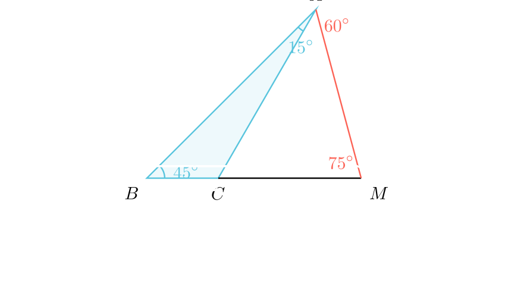

# Пресметка на агли во триаголник со продолжена страна

# Текст на задачата
Во $\triangle ABC$, $\angle ABC = 45^\circ$ и $\angle CAB = 15^\circ$. Нека $M$ е точка на полуправата $BC$, таква што $\overline{BM} = 3 \cdot \overline{BC}$. Одреди ги аглите на $\triangle ABM$.

*(Забелешка: Точката $M$ е на полуправата $BC$. Бидејќи $BM = 3BC$, редоследот на точките е $B - C - M$.)*

# 💡 Помош (Hints)
<details>
<summary>Кликни за мала помош</summary>

1. Прво, пресметај го третиот агол во $\triangle ABC$.
   $$ \angle ACB = 180^\circ - (45^\circ + 15^\circ) = 120^\circ $$

2. Искористи ја Синусната теорема за $\triangle ABC$ за да најдеш врска помеѓу страната $BC$ и страната $AB$ (или $AC$).
   $$ \frac{BC}{\sin 15^\circ} = \frac{AC}{\sin 45^\circ} = \frac{AB}{\sin 120^\circ} $$

3. Во $\triangle ABM$, знаеш две страни ($AB$ и $BM=3BC$) и аголот меѓу нив ($\angle ABM = 45^\circ$). Ова е класичен случај за Синусна теорема или Косинусна теорема. Обиди се да го најдеш $\tan(\angle BAM)$ или директно $\sin(\angle BAM)$.

</details>

#


# Решение
## 🧠 Експертска Анализа (Интуиција)
Имаме триаголник со специфични агли ($45^\circ, 15^\circ, 120^\circ$). Ова веднаш сугерира дека страните имаат "убави" односи кои вклучуваат $\sqrt{3}, \sqrt{2}$ итн.
Точката $M$ е на продолжението на $BC$ така што $BM$ е три пати поголема од $BC$.
Знаеме:
1.  Аголот кај $B$ е заеднички за $\triangle ABC$ и $\triangle ABM$ ($45^\circ$).
2.  Страната $BM$ е експлицитно дадена преку $BC$.
3.  Страната $AB$ е заедничка.

Стратегијата е јасна:
1.  Преку Синусна теорема во $\triangle ABC$ ќе го изразиме односот $AB/BC$.
2.  Во $\triangle ABM$ ќе ги знаеме односот $AB/BM$ и аголот $B$.
3.  Ќе ја искористиме Синусната теорема во $\triangle ABM$ за да го најдеме аголот $\angle AMB$ (или $\angle BAM$).

## 📐 Детално Решение

<details>
<summary>Чекор 1: Анализа на $\triangle ABC$</summary>

Аглите во $\triangle ABC$ се:
$$ \angle A = 15^\circ, \quad \angle B = 45^\circ $$
$$ \angle C = 180^\circ - (15^\circ + 45^\circ) = 120^\circ $$

Применуваме Синусна теорема за да го најдеме односот на страните $c = AB$ и $a = BC$:
$$ \frac{AB}{\sin 120^\circ} = \frac{BC}{\sin 15^\circ} $$
$$ AB = BC \cdot \frac{\sin 120^\circ}{\sin 15^\circ} $$

Знаеме дека:
$$ \sin 120^\circ = \sin(180^\circ - 60^\circ) = \sin 60^\circ = \frac{\sqrt{3}}{2} $$
$$ \sin 15^\circ = \sin(45^\circ - 30^\circ) = \sin 45^\circ \cos 30^\circ - \cos 45^\circ \sin 30^\circ $$
$$ \sin 15^\circ = \frac{\sqrt{2}}{2} \cdot \frac{\sqrt{3}}{2} - \frac{\sqrt{2}}{2} \cdot \frac{1}{2} = \frac{\sqrt{6} - \sqrt{2}}{4} $$

Заменуваме во изразот за $AB$:
$$ AB = BC \cdot \frac{\frac{\sqrt{3}}{2}}{\frac{\sqrt{6} - \sqrt{2}}{4}} = BC \cdot \frac{2\sqrt{3}}{\sqrt{6} - \sqrt{2}} $$
Рационализираме:
$$ AB = BC \cdot \frac{2\sqrt{3}(\sqrt{6} + \sqrt{2})}{6 - 2} = BC \cdot \frac{2(\sqrt{18} + \sqrt{6})}{4} = BC \cdot \frac{3\sqrt{2} + \sqrt{6}}{2} $$
Ова изгледа комплицирано. Да пробаме поелегантно.
Забележуваме дека $\sin 120^\circ = \sin(2 \cdot 60^\circ)$? Не.
Ајде да го оставиме односот како што е:
$$ \frac{AB}{BC} = \frac{\sin 120^\circ}{\sin 15^\circ} $$
</details>

<details>
<summary>Чекор 2: Анализа на $\triangle ABM$</summary>

Во $\triangle ABM$ имаме:
*   Страна $c' = AB$
*   Страна $a' = BM = 3 \cdot BC$
*   Агол $\beta = 45^\circ$

Сакаме да го најдеме аголот $\angle M = \angle AMB$. Нека го означиме со $\delta$.
Според Синусна теорема за $\triangle ABM$:
$$ \frac{AB}{\sin \delta} = \frac{BM}{\sin \angle BAM} $$
Ова воведува две непознати. Подобро е да го искористиме односот $AB/BM$:
$$ \frac{AB}{\sin \delta} = \frac{BM}{\sin \angle BAM} $$
Но, знаеме дека $\angle BAM = 180^\circ - (45^\circ + \delta)$.
Уште подобро, да ја искористиме врската со $BC$:
$$ \frac{AB}{\sin \delta} = \frac{3BC}{\sin(135^\circ - \delta)} $$
Од Чекор 1 знаеме $AB = BC \frac{\sin 120^\circ}{\sin 15^\circ}$. Заменуваме:
$$ \frac{BC \frac{\sin 120^\circ}{\sin 15^\circ}}{\sin \delta} = \frac{3BC}{\sin(135^\circ - \delta)} $$
Кратиме со $BC$:
$$ \frac{\sin 120^\circ}{\sin 15^\circ \sin \delta} = \frac{3}{\sin(135^\circ - \delta)} $$
$$ \sin(135^\circ - \delta) \cdot \sin 120^\circ = 3 \sin 15^\circ \sin \delta $$

Ова е тригонометриска равенка. Да ја решиме.
Знаеме $\sin 120^\circ = \frac{\sqrt{3}}{2}$.
Знаеме $3 \sin 15^\circ = 3 \frac{\sqrt{6}-\sqrt{2}}{4}$.
$$ \sin(135^\circ - \delta) \frac{\sqrt{3}}{2} = 3 \sin 15^\circ \sin \delta $$
Развиваме $\sin(135^\circ - \delta) = \sin 135^\circ \cos \delta - \cos 135^\circ \sin \delta$.
$\sin 135^\circ = \frac{\sqrt{2}}{2}, \cos 135^\circ = -\frac{\sqrt{2}}{2}$.
$$ (\frac{\sqrt{2}}{2} \cos \delta + \frac{\sqrt{2}}{2} \sin \delta) \frac{\sqrt{3}}{2} = 3 \sin 15^\circ \sin \delta $$
Делиме со $\cos \delta$ (претпоставувајќи $\delta \neq 90^\circ$) за да добиеме $\tan \delta$:
$$ \frac{\sqrt{6}}{4} (1 + \tan \delta) = 3 \sin 15^\circ \tan \delta $$
$$ \frac{\sqrt{6}}{4} + \frac{\sqrt{6}}{4} \tan \delta = 3 \frac{\sqrt{6}-\sqrt{2}}{4} \tan \delta $$
Множиме со 4:
$$ \sqrt{6} + \sqrt{6} \tan \delta = (3\sqrt{6} - 3\sqrt{2}) \tan \delta $$
$$ \sqrt{6} = \tan \delta (3\sqrt{6} - 3\sqrt{2} - \sqrt{6}) $$
$$ \sqrt{6} = \tan \delta (2\sqrt{6} - 3\sqrt{2}) $$
$$ \tan \delta = \frac{\sqrt{6}}{2\sqrt{6} - 3\sqrt{2}} $$
Делиме со $\sqrt{2}$ горе и долу:
$$ \tan \delta = \frac{\sqrt{3}}{2\sqrt{3} - 3} $$
Рационализираме:
$$ \tan \delta = \frac{\sqrt{3}(2\sqrt{3} + 3)}{(2\sqrt{3}-3)(2\sqrt{3}+3)} = \frac{2(3) + 3\sqrt{3}}{12 - 9} = \frac{6 + 3\sqrt{3}}{3} = 2 + \sqrt{3} $$

Знаеме дека $\tan 75^\circ = \tan(45^\circ+30^\circ) = \frac{1 + 1/\sqrt{3}}{1 - 1/\sqrt{3}} = \frac{\sqrt{3}+1}{\sqrt{3}-1} = 2+\sqrt{3}$.
Значи $\delta = 75^\circ$.
</details>

<details>
<summary>Чекор 3: Пресметка на останатите агли</summary>

Најдовме дека $\angle AMB = 75^\circ$.
Аголот $\angle ABM = 45^\circ$ (даден).
Третиот агол е $\angle BAM$:
$$ \angle BAM = 180^\circ - (45^\circ + 75^\circ) = 180^\circ - 120^\circ = 60^\circ $$
</details>

**Краен одговор:** Аглите на $\triangle ABM$ се $\boxed{45^\circ, 75^\circ, 60^\circ}$.

## 👨‍🏫 Менторски Белешки
1.  **Златен Совет:** Препознавањето на вредностите на тангенс е моќна алатка.
    *   $\tan 15^\circ = 2 - \sqrt{3}$
    *   $\tan 75^\circ = 2 + \sqrt{3}$
    Ако во текот на решавањето добиете ваков израз, веднаш знаете за кој агол се работи.
2.  **Алтернативен пристап (Синтетички):**
    Можеме да конструираме рамностран триаголник над $AB$ или да повлечеме висина.
    На пример, нека $h$ е висината од $A$ кон $BC$.
    Во $\triangle ABC$, $\angle C = 120^\circ$, што значи $C$ е тап агол. Висината паѓа на продолжението на $CB$.
    Оваа геометриска конструкција може да биде потешка за визуелизација од тригонометрискиот пристап, но е многу елегантна ако се погоди.
3.  **Проверка:**
    Ако $\angle BAM = 60^\circ$, тогаш $\angle CAM = 60^\circ - 15^\circ = 45^\circ$.
    Во $\triangle AMC$, аглите се $120^\circ$ (надворешен на $C$ е $60^\circ$, значи внатрешен е $120^\circ$? Не, $\angle ACB=120^\circ$, значи $\angle ACM = 60^\circ$).
    Агли во $\triangle AMC$: $\angle CAM = 45^\circ$, $\angle ACM = 60^\circ$ (бидејќи $C$ е помеѓу $B$ и $M$, $\angle ACM = 180-120=60^\circ$).
    Третиот агол е $\angle AMC = 180 - (45+60) = 75^\circ$.
    Ова се совпаѓа со нашето решение!

### 🔗 Поврзани вештини
*   **Примарна вештина:** Синусна теорема (Sine Theorem).
*   **Потребни предзнаења:** Тригонометриски идентитети, Вредности на тригонометриски функции за $15^\circ, 75^\circ$.

# Manim Code
```python
from manim import *

class TriangleAngles(Scene):
    def construct(self):
        self.camera.background_color = WHITE
        
        # Coordinates setup
        # B at origin (0,0)
        # Angle B = 45 deg. Line BA along y=x line? No, let BC be horizontal.
        B = np.array([-3, -1, 0])
        # M is on ray BC. Let BC be length 2. Then BM is 6.
        C = B + np.array([2, 0, 0])
        M = B + np.array([6, 0, 0])
        
        # Point A calculation
        # Angle B = 45. Line BA has angle 45.
        # Angle C (internal) = 120. Angle BCA = 120.
        # Line CA has angle 180 - 60 = 120 relative to BC?
        # Wait, C is between B and M.
        # Angle BCA = 120. So angle MCA = 60.
        # Line CA makes 60 degrees with CM (negative x direction relative to C).
        # So CA angle is 180 - 60 = 120.
        
        # Intersection of:
        # y = tan(45)(x - Bx) + By  => y = x + 3 - 1 = x + 2
        # y = tan(120)(x - Cx) + Cy => y = -sqrt(3)(x - (-1)) - 1
        
        # x + 2 = -1.732(x + 1) - 1
        # x + 2 = -1.732x - 1.732 - 1
        # 2.732x = -4.732
        # x = -1.732
        # y = 0.268
        
        # Let's use geometric construction for precision
        # AB length from sine rule: BC * sin(120)/sin(15)
        # BC = 2. AB = 2 * 0.866 / 0.2588 = 6.69
        # A = B + 6.69 * (cos45, sin45)
        
        dist_AB = 2 * np.sin(120*DEGREES) / np.sin(15*DEGREES)
        A = B + dist_AB * np.array([np.cos(45*DEGREES), np.sin(45*DEGREES), 0])
        
        # Create objects
        tri_ABC = Polygon(A, B, C, color=BLUE, fill_opacity=0.1)
        line_CM = Line(C, M, color=BLACK)
        line_AM = Line(A, M, color=RED)
        
        # Labels
        label_A = MathTex("A", color=BLACK).next_to(A, UP)
        label_B = MathTex("B", color=BLACK).next_to(B, DL)
        label_C = MathTex("C", color=BLACK).next_to(C, DOWN)
        label_M = MathTex("M", color=BLACK).next_to(M, DR)
        
        # Angles
        arc_B = Angle(Line(B, M), Line(B, A), radius=0.5, color=BLUE)
        tex_B = MathTex("45^\\circ", color=BLUE).next_to(arc_B, RIGHT)
        
        arc_A = Angle(Line(A, B), Line(A, C), radius=0.7, color=BLUE)
        tex_A = MathTex("15^\\circ", color=BLUE).next_to(arc_A, DOWN)
        
        # Animation
        self.play(Create(tri_ABC), Write(label_A), Write(label_B), Write(label_C))
        self.play(Create(arc_B), Write(tex_B), Create(arc_A), Write(tex_A))
        self.wait(1)
        
        self.play(Create(line_CM), Write(label_M))
        self.play(Create(line_AM))
        
        # Relation BM = 3BC
        brace_BC = Brace(Line(B, C), DOWN)
        text_BC = brace_BC.get_text("x")
        
        brace_BM = Brace(Line(B, M), UP)
        text_BM = brace_BM.get_text("3x")
        
        self.play(Create(brace_BC), Write(text_BC))
        self.play(Create(brace_BM), Write(text_BM))
        
        # Final Angles
        final_M = MathTex("75^\\circ", color=RED).next_to(M, UP+LEFT)
        final_A_total = MathTex("60^\\circ", color=RED).next_to(A, DOWN+RIGHT)
        
        self.play(Write(final_M), Write(final_A_total))
        self.wait(2)
```